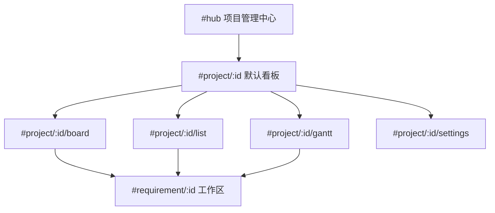

# Teambition 式项目/需求交互 + Kanban + 甘特 + OmniPlan

> 给 DeepSeek（或其它实现代理）的可执行设计。按第 13 节执行手册与第 14 节 PR 顺序落地，不要跳步。
>
> 日期：2026-08-19  
> 状态：Draft  
> 范围：桌面/Web UI、workflow-engine、integration、CLI、config  
> 约束：最小改动；沿用现有 vanilla renderer、现有甘特组件、现有 Teambition 客户端契约。

---

## 1. 目标与成功标准

把「项目 ⊃ 需求」从卡片墙改成 Teambition 式项目工作台：

1. **项目页**用顶栏切换 **看板 / 列表 / 甘特 / 设置**（不再只有卡片墙 + 右侧绑定表单）。
2. **需求以 Kanban 展示**：列 = Octopus 阶段（`PHASE_ORDER`），卡 = 需求；拖拽换列走现有阶段 API。
3. **甘特成为项目一级视图**：默认一行一个需求；可展开看该需求的节点排期（复用现有 `gantt.js`）。
4. **甘特支持导入/导出 OmniPlan `.oplx`**，默认读写  
   `/Users/ben/Documents/OmniPlan/Projects/<项目文件夹>/`。

成功标准（全部满足才算完成）：

- `#project/:id` 默认打开看板；`/list`、`/gantt`、`/settings` 可深链。
- 拖到下一列调用 `advancePhase`（含门控）；拖回前列调用 `rollbackTo`；跨列前进被拒绝并回弹。
- 拖拽**不**写 Teambition。
- 项目甘特可改需求 `plannedStart`/`plannedEnd`；展开行可改节点排期（现有 `updateNodeSchedule`）。
- 导出在映射目录生成可被 OmniPlan 打开的 `.oplx`（至少含 `Actual.xml` + `__TOC.xml`）。
- 导入只合并日期，不增删需求/节点；返回 `{ updatedRequirements, updatedNodes, unmatched, skipped }`。
- `pnpm test`、`pnpm -r build`、`git diff --check` 通过；不提交用户真实 Dior/PRC 工程文件。

### 非目标

- 不用 Teambition 工作流状态当看板列（v1 只作徽章/下拉）。
- 拖看板不自动改 TB 状态。
- 不导入 OmniPlan 资源/人员/成本/关键路径。
- 不改工作流 DAG、AI 模块、Teambition HTTP 契约（只允许加引擎封装）。
- 不引入 React/Vue；不重写 `gantt.js`。
- 不管 `.opld` 仪表盘。

---

## 2. 现状（实现前必须对照的事实）

| 层级 | 现在 | 痛点 |
| --- | --- | --- |
| Hub `#hub` | 项目卡片墙 | 可保留 |
| 项目 `#project/:id` | 需求卡片墙 + 右侧创建 + TB 绑定；卡片「排期」展开节点甘特 | 不像 TB；甘特藏在卡片里；无看板 |
| 工作区 `#requirement/:id` | 角色泳道 + 顶栏 TB 任务条 | 保留 |
| 排期 | 仅 `StepRuntime.plannedStart/End` | 需求级没有日期，项目甘特无法画条 |
| 导入导出 | `exportTasks` / `importTasks`（`octopus.tasks` JSON） | 不是 OmniPlan |
| 阶段 | `advancePhase` 有任务/清单/AI 门控并生成下阶段 steps；`rollbackTo` 只能回退 | 看板不能直接写 `currentPhase` |

关键文件：

- `packages/core/src/project.ts` — `Project.metadata?: Record<string, string>`
- `packages/core/src/workflow.ts` — `CURRENT_SCHEMA_VERSION = 5`，`RequirementSummary` 无排期
- `packages/core/src/step.ts` — 节点 `plannedStart`/`plannedEnd`（`YYYY-MM-DD`）
- `packages/core/src/phase.ts` — `PHASE_ORDER`、`PHASE_LABELS`、`isValidTransition`、`getNextPhase`
- `packages/workflow-engine/src/index.ts` — `updateNodeSchedule`、`advancePhase`、`rollbackTo`、`listRequirementSummaries`
- `packages/integration/src/teambition.ts` — 保持不动
- `packages/desktop/src/renderer/renderer.js` — `routeFromHash`、`buildRequirementCardsMarkup`、`toggleHubSchedule`
- `packages/desktop/src/renderer/gantt.js` — `window.OctopusGantt`，模型按 `steps` + phase 分组
- `packages/desktop/src/web.ts` / `main.ts` / `browser-api.js`
- `packages/desktop/src/web.test.ts` — 用 `extractFunction` 单测 `buildHubCardsMarkup`
- `packages/context/src/config.ts` — 尚无 omniplan 配置
- `packages/cli/src/commands/project.ts` / `phase.ts`

OmniPlan 样例（只读，勿提交）：

```
/Users/ben/Documents/OmniPlan/
  Projects/cdc-dior/*.oplx
  Projects/lc-prc/PRC.oplx
  Templates/MiniTemplate.oplx
  Templates/BaseTemplate.oplx
  Templates/仪表盘.opld          # 忽略
```

`.oplx` = zip，内含 `Actual.xml`、`__TOC.xml`、`__changelog.xml`、`Preview.png`。  
`Actual.xml` 命名空间 `http://www.omnigroup.com/namespace/OmniPlan/v2`。  
样例日期形如 `2024-05-29T02:00:00.000Z`（上海日历日 00:00）。`effort` 单位秒，一天工作 28800。

---

## 3. 关键决策

1. **看板列 = `PHASE_ORDER`，不是 TB 状态。** 离线可用，与领域模型一致。TB 状态只做徽章 + 卡片内下拉。
2. **换列必须走现有阶段机，禁止直接赋值 `currentPhase`。**  
   - 下一列 → `engine.advancePhase(id)`（门控失败则回弹，展示 `PhaseLockedError` 文案）。  
   - 更前列 → `engine.rollbackTo(id, targetPhase)`。  
   - 跨列前进（Intention → Design）→ 拒绝。  
   同一列放下 = no-op。
3. **甘特分两层、一套组件。** 项目层画需求条；展开后复用现有节点甘特。给 `gantt.js` 加 `mode: "requirements" | "nodes"`，不要新依赖。
4. **需求增加 `plannedStart`/`plannedEnd`，校验镜像 `updateNodeSchedule`。** schema 升到 6；旧状态缺字段视为未排期。
5. **OmniPlan 落盘固定根目录，可配置。** 默认 `/Users/ben/Documents/OmniPlan`；`OCTOPUS_OMNIPLAN_ROOT` 或 `.octo/config.json` 的 `omniplan.rootDir` 可覆盖。项目文件夹名存 `project.metadata.omniplanFolder`。
6. **映射：项目 → 根 group；需求 → group 任务；节点 → 叶子任务。** 导入只 merge 日期。稳定 ID 写入 `<note>`，并缓存到 `project.metadata.omniplanIdMap`（JSON 字符串）。
7. **导出以 `Templates/MiniTemplate.oplx` 为骨架**：保留 prototype / 资源日历 / `__TOC.xml` 窗口布局，替换任务树。不强制 `Preview.png` / `__changelog.xml`。
8. **zip/xml 自研最小实现，不引入新 npm 依赖。** `packages/integration/src/zip-store.ts` 只处理若干已知条目；XML 用转义拼接 + 面向任务子集的解析器。
9. **Web 与 Electron 行为分开。** Electron/CLI 写映射目录；纯 Web 若无权写 Documents，export 返回 zip buffer 下载，import 接收上传。
10. **文档先入 `docs/plans/`，再按 4 个 PR 实现。**

---

## 4. 信息架构与路由



改 `routeFromHash()`（`renderer.js`）：

| hash | view | projectTab |
| --- | --- | --- |
| `#hub` / 空 | hub | — |
| `#project/:id` | project | board |
| `#project/:id/board` | project | board |
| `#project/:id/list` | project | list |
| `#project/:id/gantt` | project | gantt |
| `#project/:id/settings` | project | settings |
| `#requirement/:id` | workspace | — |

删除把 `#project/:id/gantt` 当成 `legacyProject` 再重定向的逻辑，该 hash 就是新甘特页。

`setChrome("project")` 副标题改为「看板 · 列表 · 甘特 · 设置」。`projectPageTitle` 显示项目名 + 当前 tab。

设置页迁入现有右侧 TB 绑定表单，并增加 OmniPlan 文件夹名编辑。看板/列表右侧保留「创建需求」。

---

## 5. 数据模型

### 5.1 `WorkflowState` / `RequirementSummary`

`packages/core/src/workflow.ts`：

```ts
// WorkflowState 与 RequirementSummary 均增加：
plannedStart?: string  // YYYY-MM-DD
plannedEnd?: string
```

`CURRENT_SCHEMA_VERSION = 6`。`migrateWorkflowState`：v5→v6 只升版本，缺日期保持 `undefined`。更新 `packages/core/src/migrate.test.ts`。

`createEmptyWorkflowState` 不必预填日期。

`listRequirementSummaries` 把这两个字段透出（与 `teambitionTaskId` 同样用条件展开）。

### 5.2 项目 metadata

`Project.metadata` 已是 `Record<string, string>`，不改类型。约定键：

| key | 含义 |
| --- | --- |
| `omniplanFolder` | `Projects/` 下相对目录，如 `cdc-dior` |
| `omniplanIdMap` | JSON：`{ "requirement:<id>": "t198", "node:<reqId>:<nodeId>": "t220" }` |
| `omniplanFileName` | 可选，目录内目标 `.oplx` 文件名 |

禁止 `..`、绝对路径、斜杠。非法值引擎抛错。

新增 `updateProjectMeta` 允许补丁 `metadata` 指定键（或单独 `setProjectOmniPlanFolder`）。不要让通用 meta 接口被任意键污染——**只允许上述三个键**通过桌面/CLI 写入。

### 5.3 配置

`packages/context/src/config.ts`：

```ts
export interface OmniPlanConfig {
  rootDir: string  // 默认 "/Users/ben/Documents/OmniPlan"
}

export interface OctopusConfig {
  // 现有字段...
  omniplan?: OmniPlanConfig
}
```

- 文件：`omniplan.rootDir`
- 环境变量：`OCTOPUS_OMNIPLAN_ROOT`（更高优先级）
- 默认：`/Users/ben/Documents/OmniPlan`

`mergeConfigs` / `configFileSchema` / `loadFromEnv` 同步改。补 `packages/context/src/config.test.ts`。

---

## 6. 引擎 API

全部加在 `packages/workflow-engine/src/index.ts`，测试放 `index.test.ts`（克隆 `updateNodeSchedule` / `advancePhase` 用例风格）。

### 6.1 需求排期

```ts
updateRequirementSchedule(
  requirementId: string,
  schedule: { plannedStart?: string | null; plannedEnd?: string | null },
): WorkflowState
```

规则与 `updateNodeSchedule` 完全一致：双空清除；否则必须成对 `YYYY-MM-DD` 且 `end >= start`；非法抛中文错。`transactionalUpdate` 写 `plannedStart`/`plannedEnd`。

### 6.2 看板换列（薄封装，方便 UI 一个 RPC）

```ts
moveRequirementPhase(requirementId: string, toPhase: Phase): WorkflowState
```

伪代码：

```
from = state.currentPhase
if (to === from) return state
if (!PHASE_ORDER.includes(to)) throw "未知阶段"
fromIdx = getPhaseIndex(from); toIdx = getPhaseIndex(to)
if (toIdx === fromIdx + 1) return this.advancePhase(requirementId)
if (toIdx < fromIdx) return this.rollbackTo(requirementId, to)
throw new InvalidPhaseTransitionError(from, to, "看板只能前进到下一阶段，或回退到已到达的阶段")
```

不要新开「跳过门控」参数。UI 层捕获错误并回弹卡片。

桌面/Web 暂不直接暴露 `advancePhase` 也行，但 `moveRequirementPhase` 必须暴露。

### 6.3 OmniPlan

```ts
exportProjectOmniPlan(
  projectId: string,
  options?: { fileName?: string; rootDir?: string },
): { path: string; taskCount: number; folder: string }

importProjectOmniPlan(
  projectId: string,
  options?: { fileName?: string; path?: string; rootDir?: string },
): {
  updatedRequirements: number
  updatedNodes: number
  unmatched: string[]
  skipped: string[]
  path: string
}
```

路径算法见 §7。引擎负责：load 项目与全部需求 → 调 `@octopus/integration` 纯函数 → 写 zip / 读 zip → 回写 schedule 与 `omniplanIdMap`。

Web 额外方法（`web.ts`）：

```ts
exportProjectOmniPlanBuffer(projectId): { fileName: string; base64: string }
importProjectOmniPlanBuffer(projectId, base64: string)
```

仅当 `rootDir` 不可写或不存在且调用方要下载时使用。Electron 走文件 API，不走 buffer。

---

## 7. OmniPlan 格式与路径

### 7.1 路径

```
{rootDir}/Projects/{omniplanFolder}/{fileName}.oplx
{rootDir}/Templates/MiniTemplate.oplx
```

`resolveOmniPlanFolder(project)`：

1. `metadata.omniplanFolder` 若合法则用。
2. 否则 slug：`project.name` NFD 去音调 → 小写 → 非 `[a-z0-9]+` 换成 `-` → 压缩连字符 → trim `-`。
3. 若 slug 为空（纯中文名）：`project-{projectId 去前缀后 8 位}`。
4. 若目录已被**另一个**项目占用（检测：目录内 `.oplx` 的 note/idMap 指向其它 projectId，或我们写一个 `.octopus-project` 标记文件）：后缀 `-{shortId}`。
5. 首次成功解析后写回 `metadata.omniplanFolder`。

导出选文件：

1. `options.fileName` 优先。
2. 否则 `metadata.omniplanFileName`。
3. 否则目录内恰好 1 个 `.oplx` → 覆盖它（利于和已有 `PRC.oplx` / `DiorCDC.oplx` 往返）。
4. 否则 `{sanitizedProjectName}.oplx`（空格变 `-`）。
5. 多个 `.oplx` 且未指定 → 抛错，列出文件名，要求 `--file` 或设置页选择。

导入同理；`options.path` 为绝对路径时可绕过映射（CLI `--file`）。仍禁止路径逃逸到 `rootDir` 之外，除非是用户显式绝对 `--file`。

设置页显示：根目录（只读，来自配置）、文件夹名（可编辑）、当前目标文件。

例：

| 项目名 | folder |
| --- | --- |
| 已设 `cdc-dior` | `cdc-dior` |
| `LC PRC` | `lc-prc` |
| `商城改版` | `project-a1b2c3d4`（无拉丁字母时） |
| 冲突 | `lc-prc-a1b2c3d4` |

### 7.2 模块划分

新建（均在 `packages/integration`）：

- `src/zip-store.ts` — 读/写 PKZIP（deflate 或 store）。`readZip(buf) → Map<name, Buffer>`，`writeZip(entries) → Buffer`。必须能解开真实 `MiniTemplate.oplx`。
- `src/omniplan.ts` — 解析/生成 `Actual.xml`，组装 `.oplx`。
- `src/omniplan.test.ts`
- `fixtures/omniplan/mini-actual.xml` — 从 MiniTemplate 裁剪后的夹具（任务树缩小，保留 namespace、prototype、一个 group、两个叶子、一条 prerequisite）。
- `fixtures/omniplan/mini.oplx` — 由测试生成或提交裁剪 zip。

`src/index.ts` 导出 `parseOmniPlanActual`、`buildOmniPlanActual`、`packOplx`、`unpackOplx` 及类型。

不要把用户 `cdc-dior` / `lc-prc` 文件拷进仓库。

### 7.3 XML 映射

命名空间：`http://www.omnigroup.com/namespace/OmniPlan/v2`。

导出任务树：

```
t-root (group, 无 title 或 title=项目名)     ← 对应 OmniPlan top-task
  t-project (group, title=project.name)
    t-req-* (group, title=requirementName)
      t-node-* (task, title=node.name)
```

| Octopus | XML |
| --- | --- |
| 项目名 | 根 group `<title>` |
| 需求名 | group `<title>` |
| 节点名 | leaf `<title>` |
| `requirementId` | `<note>octopus:requirement:{id}</note>` |
| `requirementId + nodeId` | `<note>octopus:node:{reqId}:{nodeId}</note>` |
| `plannedStart` | `<locked-start-date>{YYYY-MM-DD}T02:00:00.000Z</locked-start-date>` |
| 工期 | `<effort>` = `(daysInclusive)*28800`；未排期叶子不写 locked-start，effort 用 28800 |
| 未排期需求 group | 无 locked-start |
| `dependsOn`（两端都导出） | `<prerequisite-task idref="t-..."/>` |
| 节点完成度 | 不写（v1）；状态仍以 Octopus 为准 |

日期约定：本地日历日按 **Asia/Shanghai** 解释，即 `YYYY-MM-DD` ↔ `YYYY-MM-DDT02:00:00.000Z`，与现有用户文件一致。导入时取 ISO 的日历日（`slice(0,10)`），不要用本地 TZ 再偏一天。

需求 group 的 locked-start / effort：有 `plannedStart/End` 用需求级；否则用子节点 min/max（仅导出展示，不在导入时覆盖空的需求排期，除非 group 自身带 locked-start）。

`recalculate` 一律 `duration`。`static-cost` 0。叶子不设 `type`（默认 task）；group 设 `type=group`。

ID：优先复用 `omniplanIdMap`；否则 `t-{stableHash}`（hash 基于 note key，避免每次导出 ID 漂移）。写回 idMap。

资源：原样保留模板里的 `<resource>` / `<prototype-resource>` / 工作周。v1 **不**写 `<assignment>`（避免伪造人员）。

`__TOC.xml`：从 MiniTemplate 拷贝；把 `editing-scenario` 改成新 scenario id（与 Actual.xml `scenario@id` 一致）。scenario id 稳定：`op-{slug}` 的安全子集（OmniPlan 样例是 `[A-Za-z0-9]`）。

导入匹配顺序：`<note>` → idMap → title 在同一父 group 下唯一匹配。都不中则进 `unmatched`。类型为 milestone 的跳过（`skipped`）。

导入写回：

- 叶子：`updateNodeSchedule`（缺日期则清除？**否**——缺 locked-start 的叶子记 `skipped`，不清除已有排期，防止 OmniPlan 未调度任务抹掉 Octopus 数据）。
- 需求 group：若有 locked-start + 能推算 end（start + effort/28800 - 1 天）→ `updateRequirementSchedule`。

### 7.4 XML 实现注意

- 导出：手写 XML，所有文本走 `escapeXml`（`& < > " '`）。
- 导入：不要用正则跨标签硬拆。写一个只认元素/属性/文本的小解析器，或按行/事件扫 `task` 子树。必须覆盖自闭合 `<prerequisite-task idref="t198"/>` 与成对标签。
- 忽略未知子元素，防止 OmniPlan 新字段往返丢失——**导出若是 round-trip 同一文件**：若导入后再导出，以 Octopus 为真相源重建任务树（会丢掉 OmniPlan 侧未映射字段）。在 UI 提示「导出会按 Octopus 任务树重建 .oplx，未映射的 OmniPlan 字段不会保留」。对已有 `DiorCDC.oplx` 这种手维护文件，默认覆盖前在 Electron 确认框提示；CLI 要 `--yes`。

---

## 8. UI 设计（Teambition 交互）

### 8.1 项目页骨架

`index.html` `#projectView`：

```
[ 看板 ] [ 列表 ] [ 甘特 ] [ 设置 ]     筛选框
-----------------------------------------
主区（随 tab 切换）          |  侧栏
                             |  创建需求（看板/列表）
                             |  或设置说明（设置）
```

样式跟现有 token（`--el-*`、`.hub-toolbar`、`.hub-card`）。Tab 用一组 `button`，`aria-selected`，active 底边主色。

### 8.2 看板

新增 `buildKanbanMarkup(items, { filter, lastCreatedId })`，风格对齐 `buildRequirementCardsMarkup`，供 `web.test.ts` 抽取单测。

列：`PHASE_ORDER` × `PHASE_LABELS`。列头：`意向 3`。空列保留。

卡片：

- 标题、描述一行、`节点 completed/total`、TB 徽章（`statusName` 或「未绑定任务」）、排期 `03-01 → 03-12` 或「未排期」、更新时间。
- `draggable="true"`，`data-requirement-id`，`data-phase`。
- 操作：打开 / 编辑 / 删除；已绑定则内嵌 `<select>` 调现有 `updateRequirementTeambitionStatus`（阻止 drag 启动）。
- 点击卡片空白进工作区；点按钮 `stopPropagation`。

拖拽：HTML5 DnD（与现有风格一致，不引库）。

- `dragstart` 记 id + fromPhase。
- 列 `dragover preventDefault`，高亮。
- `drop` → `octopus.moveRequirementPhase(id, toPhase)` → 成功刷新摘要；失败 `showError` + 不改 DOM（或先 optimistic 再回滚）。
- 门控失败文案直接用引擎错误（「有 N 个任务未完成」等）。

筛选：卡片按名称/ID/描述过滤；列仍在。

创建需求成功后：卡片出现在意向列并 `highlight`（沿用 `lastCreatedRequirementId`）。

### 8.3 列表

现有卡片墙 + 「排期」展开节点甘特，行为不变。TB 绑定从表单移走后，列表侧栏只留创建需求。

### 8.4 甘特（项目一级）

`#project/:id/gantt` 全宽 `#projectGanttHost`（不要再用卡片下方的 `hubGanttHost` 小条）。工具条在 `gantt.js` 内扩展：

- 已有：日/周/月、今天、只读、依赖线
- 新增：`导出 OmniPlan`、`导入 OmniPlan`
- hint：`文件：/Users/ben/Documents/OmniPlan/Projects/<folder>/`

`OctopusGantt` 扩展：

```js
// 现有
render({ steps, runs, snapshot, selectedNodeId, labels })

// 新增
render({
  mode: "requirements",
  requirements: [{
    id, name, phase, plannedStart, plannedEnd,
    statusLabel, progress, teambitionStatusName,
    steps,  // 展开时用
  }],
  selectedId,
  labels,
})
```

`mode !== "requirements"` 时保持旧 `buildModel`。  
`mode === "requirements"`：一行一需求；有 twistie；展开后插入节点子行（复用现有 node 行渲染）。依赖线：v1 需求之间不画（需求无 dependsOn）；展开后画节点 `dependsOn`。

`onSchedule(id, schedule, kind: "requirement" | "node")`。项目层改日期走 `updateRequirementSchedule`；节点走现有 `updateNodeSchedule`。

未排期需求进底部 chip 托盘，交互同现节点芯片。

从列表「排期」仍可把 `gantt.js` mount 到卡片下（`mode` 默认 nodes）。注意 **同一时间只 mount 一个**（已有 `unmount`）。切到甘特 tab 时 `park` 列表里的实例。

窄屏：沿用 `is-narrow-gantt`。

### 8.5 设置

从项目页右侧挪来：

- TB 项目 ID / 前缀 / 绑定 / 解绑 / 查看卡片状态（现有按钮与 `#tbBindInfo` / `#tbStatusList`）
- OmniPlan 文件夹名、目标文件名、只读根路径、打开目录（Electron：`shell.openPath`；Web：显示路径）
- 危险：删除项目（可仍留在 Hub 卡片）

工作区 `#requirementTbBar` 不动。

### 8.6 新 RPC

`browser-api.js` + `web.ts` + `main.ts` 同步：

- `moveRequirementPhase(requirementId, toPhase)`
- `updateRequirementSchedule(requirementId, schedule)`
- `exportProjectOmniPlan(projectId, opts?)`
- `importProjectOmniPlan(projectId, opts?)`
- `setProjectOmniPlanFolder(projectId, folder, fileName?)`（或扩 `updateProjectMeta`）

Electron 导入默认读映射文件；可选 `dialog.showOpenDialog` 滤 `*.oplx`。导出默认写映射路径，成功后 `statusEl` 显示完整 path。覆盖已有文件先 `dialog.showMessageBox` 确认。

---

## 9. CLI

`packages/cli/src/commands/project.ts` 增加：

```
octopus project omniplan-export <projectId> [--file name] [--yes] [--json]
octopus project omniplan-import <projectId> [--file pathOrName] [--json]
octopus project omniplan-folder <projectId> [--set <folder>] [--file-name <name>] [--json]
```

`--yes` 跳过覆盖确认。错误进 stderr + exit 1，风格与现有命令一致。

阶段拖拽对应的 CLI 已存在：`octopus phase advance` / `rollback`，不必再做看板 CLI。

`packages/cli/src/cli.test.ts` 覆盖新子命令解析与一次假目录往返（用 tmp + fixture）。

---

## 10. 测试矩阵

| 包 | 用例 |
| --- | --- |
| `core` | schema 6 迁移；RequirementSummary 类型编译 |
| `context` | `omniplan.rootDir` 文件/环境变量优先级 |
| `integration` | zip 解开 MiniTemplate 夹具；escape；日期 ↔ `T02:00:00.000Z`；note 往返；prerequisite；非法 XML；路径 slug；`..` 拒绝 |
| `workflow-engine` | `updateRequirementSchedule` 成对/清除/非法；`moveRequirementPhase` 前进走门控、后退走 rollback、跨列抛错、同列 no-op；export 写 tmp 目录；import 只更新匹配任务；不匹配进 unmatched；不清除缺日期叶子 |
| `desktop/web.test.ts` | 新 RPC；`buildKanbanMarkup` 空/无匹配/分列；hash `.../gantt` 不再当 legacy |
| `cli` | export/import 在 tmp root 往返 |

禁止测真实 `/Users/ben/Documents/OmniPlan/Projects/cdc-dior`。引擎测试把 `rootDir` 指到 `mkdtempSync`。

手工验收（实现代理在 macOS 上）：

1. `pnpm --filter @octopus/desktop web`，看板拖一张可前进的卡、一张被门控挡住的卡。
2. 甘特改需求日期，刷新仍在。
3. 导出到 `~/Documents/OmniPlan/Projects/<folder>/`，用 Finder 确认 `.oplx`；若本机有 OmniPlan 则打开看任务树。
4. 在 OmniPlan（或手改 Actual.xml 日期）后再导入，节点/需求日期变化。

无浏览器自动化工具时，以 vitest + 上述手工步骤为准，并在 PR 说明里写清未开 OmniPlan GUI 的部分。

---

## 11. 风险

| 风险 | 级别 | 缓解 |
| --- | --- | --- |
| OmniPlan 打开自研 zip/xml 失败 | 高 | 以 MiniTemplate 为骨架；fixture 对比关键标签；本机用 OmniPlan 打开一次 |
| 覆盖手维护 `.oplx` 丢失额外字段 | 高 | 覆盖确认；UI 文案说明以 Octopus 为真相 |
| 看板拖拽跳过门控破坏 steps | 高 | 必须走 `advancePhase`/`rollbackTo` |
| 误写 Teambition | 中 | 换列不调 TB；只有徽章下拉才写 |
| `omniplanFolder` 路径穿越 | 中 | 只允许 `[A-Za-z0-9._-]+` |
| 上海时区假设 | 低 | 与现有 oplx 一致；写进文档 |
| `gantt.js` 双模式回归 | 中 | 列表「排期」旧路径加断言；nodes 模式输入不变 |
| Web 写不了 Documents | 低 | buffer 下载/上传回退 |

---

## 12. 备选（已否决）

1. **TB 状态当列** — 未绑定不可用；与 `currentPhase` 双写。以后若要做，加第三 tab，不替换阶段看板。
2. **OmniPlan 只导节点、不要需求 group** — 项目甘特与文件一对不上；多需求会扁成一堆。
3. **引入 frappe-gantt / dhtmlx** — 已有 Teambition 风格 `gantt.js`，新依赖与主题不一致。
4. **每个需求一个 oplx** — 用户目录是「一项目一夹」，与 `cdc-dior`/`lc-prc` 用法不符。

---

## 13. DeepSeek 执行手册

批准后严格按序做。每步结束跑相关测试。不要把后续 PR 的重构提前做进前面。

### 第 0 步 — 落文档

本文即 `docs/archive/teambition-kanban-gantt-omniplan.md`。README「图形界面」段已指向本方案与 OmniPlan 默认目录。实现代理从 PR1 开始写代码。

### PR1 — 数据与引擎（无 UI）

文件：

- `packages/core/src/workflow.ts`、`migrate.test.ts`
- `packages/workflow-engine/src/index.ts`、`index.test.ts`
- `packages/context/src/config.ts`、`config.test.ts`
- `packages/desktop/src/web.ts`、`main.ts`、`browser-api.js`、`web.test.ts`（先挂 RPC，UI 可暂不调用）
- `packages/cli/src/commands/project.ts`（可先不加 omniplan 子命令，或只加 folder）

做：schema 6、`updateRequirementSchedule`、`moveRequirementPhase`、config `omniplan`。  
测：`pnpm --filter @octopus/core test`、`workflow-engine`、`context`。  
不要改 renderer 外观。

### PR2 — OmniPlan I/O

文件：

- `packages/integration/src/zip-store.ts`、`omniplan.ts`、`omniplan.test.ts`、`index.ts`
- `packages/integration/fixtures/omniplan/*`
- `packages/workflow-engine` 的 `exportProjectOmniPlan` / `importProjectOmniPlan`
- CLI `omniplan-export` / `omniplan-import` / `omniplan-folder`
- desktop RPC

做：路径算法、模板导出、merge 导入。测试全走 tmp。  
测：integration + engine + cli。用 MiniTemplate 夹具，不要读用户真实项目（除非本地手工）。

### PR3 — 项目页 Teambition 交互 + Kanban

文件：

- `packages/desktop/src/renderer/index.html`（tab、`#kanbanBoard`、设置区）
- `renderer.js`（路由、`buildKanbanMarkup`、`renderProjectPage`、设置迁移）
- `web.test.ts` 抽 `buildKanbanMarkup`、hash

做：看板默认视图；列表保留；设置承载 TB；卡片 TB 下拉；DnD → `moveRequirementPhase`。  
不要在这一步做项目甘特。列表「排期」仍可用旧 hub gantt。

验：窄屏、空项目、筛选、非法拖拽回弹、未配置 TB 时下拉错误文案走 `readableError`。

### PR4 — 项目甘特模块

文件：

- `gantt.js`（`mode: "requirements"`，导入导出按钮）
- `renderer.js` / `index.html`（甘特 tab 全宽 host、接 schedule/omniplan RPC）
- `web.test.ts`（gantt 源码仍导出 `OctopusGantt`；requirements 模式不破坏 nodes）

做：需求条拖拽、展开节点、未排期托盘、导入导出确认框。  
验：列表排期与甘特 tab 不同时 mount；导出 path 显示在 badge。

### 每 PR 验证命令

```bash
pnpm test
pnpm -r build
git diff --check
```

桌面相关再加：

```bash
pnpm --filter @octopus/desktop test
```

（若该包 test 脚本不存在，跑 `web.test.ts` 所在的 workspace test 入口，即根 `pnpm test`。）

### 实现时禁止

- 不要提交 `/Users/ben/Documents/OmniPlan/Projects/**` 真实文件。
- 不要为换列新写一套 phaseStatus 手改逻辑。
- 不要把 TB `updateTask` 接到 DnD。
- 不要新增 UI 框架或甘特库。
- 不要重排无关文件、不要「顺便」改 workflow.yaml。
- 不要在 Web 服务里默认监听非回环地址。

---

## 14. PR Plan（汇总）

1. **chore(docs): 写入 Teambition Kanban/Gantt/OmniPlan 方案**  
   `docs/archive/teambition-kanban-gantt-omniplan.md`、README 一小段。无依赖。

2. **feat(core): 需求排期字段、阶段移动 API、OmniPlan 配置**  
   core / engine / context / 薄 RPC。依赖 1。

3. **feat(integration): OmniPlan .oplx 导入导出**  
   integration + engine 文件 I/O + CLI。依赖 2。

4. **feat(desktop): 项目页看板与设置（Teambition 交互）**  
   renderer 路由/看板/设置。依赖 2。

5. **feat(desktop): 项目甘特模块对接 OmniPlan**  
   gantt.js 双模式 + 导入导出按钮。依赖 3 和 4。

桌面 4 与集成 3 可并行（都只依赖 2）。甘特必须两者之后。

---

## 15. 实现代理开工检查清单

1. 读本文件 + 上列「关键文件」，不要凭记忆改阶段机。
2. 先写文档 PR，再写代码。
3. 先红后绿：每个新引擎方法先补测试。
4. OmniPlan 先让 `unpackOplx(MiniTemplate夹具)` 过，再写生成器。
5. UI 先看板后甘特。
6. 自测拖拽门控失败、路径 `..`、多 oplx 未指定文件、导入 unmatched。
7. 在 PR 描述里列出：改动文件、测试结果、若未打开 OmniPlan GUI 要注明。
