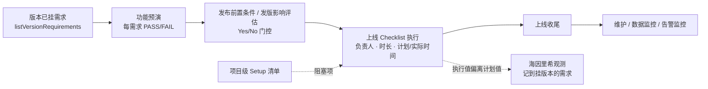

# 版本发布计划模式（Release Plan Mode）

日期：2026-09-15  
状态：Draft  
范围：core、integration、workflow-engine、CLI、desktop  
前置：`docs/plans/teambition-version-plan.md`（TB 版本仓库 / 需求 ↔ 版本绑定已落地）

> **禁止**把线下上线 Checklist 模板（含真实组织名、人名、SCRUM 编号、内网命令）提交进仓库、fixture 或测试快照。测试一律用 exceljs 现场构造伪造工作簿。

---

## 1. Overview

TB 版本计划解决了「版本是什么、哪些需求挂在版本上」，但一个版本 **从预演到上线到维护** 的流程仍靠线下 Excel：

`base stencil基础模版-版本内容-项目名-组织名-interior CheckList-{owner}-{ver}-{date}-{状态}.xlsx`

本方案在 **TB 版本** 上挂一份「发布计划（Release Plan）」，把 Excel 流程串起来：



Excel 支持 **导入模板** 与 **导出执行版**（同格式归档）。

## 2. Goals & Non-Goals

### 目标

1. 项目可导入上线 Checklist xlsx 作为模板（`上线计划` + `Setup`）。
2. 每个 TB 版本可基于模板创建一份发布计划；预演行自动来自该版本已挂需求。
3. 门控行（发布前置条件 / 发版影响评估）可答 Yes/No；No 置灰，不计进度、不可改状态。
4. Checklist 行可改状态 / 负责人 / 执行内容 / 实际时间；可按时长自动排期。
5. 执行内容偏离导入时的计划值 → 标偏差，并对该版本每个挂靠需求记 1 条 TRIVIAL 海因里希观测（去重）。
6. 计划有派生阶段（PREPARE → REHEARSAL → RELEASING → MONITORING → DONE）与阻塞项。
7. 可导出 xlsx：`上线计划`、`上线计划-检查`、`功能预演`、`Setup`。
8. CLI `octopus release …` 与桌面「发布计划」tab。

### 非目标（v1）

- 不做 `回滚计划` sheet（导入忽略、导出不写）。
- 不做跨行门控联动（如「有 db_schema = No → 灰 SQL DDL 预执行」），见 Open Questions。
- 不改 `workflow.yaml`、阶段机、`go-live-check` 节点语义；发布计划不驱动 `advancePhase`。
- 不写回 Teambition；不改 `unbind*` 语义；解绑版本仓库不级联删除计划。
- 不执行 Checklist 里的 shell / SQL 命令，只作为文本。

## 3. Excel 事实（实现必须对照）

### 3.1 `上线计划`

| 列 | 表头 | 映射 |
| --- | --- | --- |
| A | 阶段 | 模板中为空，忽略 |
| B | 项目 Release Item | `group`；**纵向合并单元格**，需前向填充 |
| C | 任务 Task | `task` |
| D | 备注 Remark | `remark` |
| E | 执行内容/状态 | `content`；导入时同时写 `plannedContent` |
| F | 状态 Status | `status`；数据验证 `To do,Ongoing,Done,Close` |
| G | 负责人 Owner | `owner` |
| H | 依赖 Dependency | `dependency`（文本） |
| I | 持续时间(分钟) | `durationMin` |
| J / K | 预计开始 / 完成时间 | `plannedStart` / `plannedEnd` |
| L / M | 实际开始 / 完成时间 | `actualStart` / `actualEnd` |
| N | 海因里希因素 | 导出时写 `偏差` |

- 按 **表头文字前缀** 定位列（`项目`、`任务`、`备注`、`执行内容`、`状态`、`负责人`、`依赖`、`持续时间`、`预计开始`、`预计完成`、`实际开始`、`实际完成`），不写死列号。
- 表头行中的换行（`项目\nRelease Item`）取第一行比较。
- 任务（C）为空且 E 也为空的行跳过；C 为空但 E 有值（如同组第二条 SQL）时 `task` 继承上一行任务。
- 公式单元格取缓存 `result`，无结果则视为空（模板 SQL 分类公式导入后为空，这是预期）。
- 原表 AA 列 `=E<>'上线计划-检查'!E` + 分组条件格式高亮 F —— 即偏差规则的来源。

### 3.2 门控行

分组名为 `发布前置条件`、`发版影响评估`（B 列合并后，子分组「开发核验」「发版影响评估」写在 C 列首行，任务在 D 列）。

识别规则：行所在 B 分组 ∈ {发布前置条件, 发版影响评估} **且** E ∈ {Yes, No}（忽略大小写与首尾空白） → 门控行。

- `gateKey` = `gate_{序号}`（按出现顺序，稳定）。
- `label` = D 列备注（如「有 db_schml」）为空时回退 C 列。
- 模板值 `No` 仅是默认占位，导入后 flag `value` 为 `null`（未答），UI 与阻塞项要求逐条确认。

### 3.3 `上线计划-检查`

计划值快照。导入只读 `上线计划`（快照即导入时的 E 列）；导出时由 `plannedContent` 重建本表。

### 3.4 `功能预演`

表头：需求编号｜任务 Task｜开发人员｜预演结果。导入只校验存在（缺失不报错）；行数据由版本挂靠需求生成。

### 3.5 `Setup`

表头：Type/Server｜Task-Zh_cn｜（命令，无表头）｜Handler｜Finish Date｜Status｜Check Date｜Inspector｜Check Result ScreenShot。Type 列纵向合并，前向填充。截图列 v1 不导入。

## 4. Data Model（`packages/core/src/release-plan.ts`）

纯类型 + 纯函数，零依赖，`packages/core/src/index.ts` 追加 `export *`。

```ts
export type ReleaseItemStatus = "TODO" | "ONGOING" | "DONE" | "CLOSE"

export interface ReleaseGateFlag {
  key: string
  group: "precondition" | "impact"
  label: string
  /** null = 未答 */
  value: boolean | null
}

export interface ReleasePlanItem {
  id: string
  group: string
  task: string
  remark?: string
  content?: string
  /** 导入时 E 列快照（对应「上线计划-检查」） */
  plannedContent?: string
  status: ReleaseItemStatus
  owner?: string
  dependency?: string
  durationMin?: number
  plannedStart?: string
  plannedEnd?: string
  actualStart?: string
  actualEnd?: string
  /** 仅门控行 */
  gateKey?: string
  deviation?: boolean
  heinrichLoggedAt?: string
}

export interface ReleaseRehearsal {
  requirementId: string
  requirementName: string
  owner?: string
  result: "TODO" | "PASS" | "FAIL"
  note?: string
}

export interface SetupChecklistItem {
  id: string
  type: string
  task: string
  command?: string
  handler?: string
  finishDate?: string
  status?: string
  checkDate?: string
  inspector?: string
}

export type ReleaseTemplateItem = Omit<ReleasePlanItem, "id" | "status" | "deviation" | "heinrichLoggedAt">
  & { status?: ReleaseItemStatus }

export interface ReleaseChecklistTemplate {
  name: string
  importedAt: string
  items: ReleaseTemplateItem[]
  setup: Omit<SetupChecklistItem, "id">[]
}

export interface ReleasePlan {
  versionId: string
  versionName?: string
  templateName: string
  createdAt: string
  updatedAt: string
  flags: ReleaseGateFlag[]
  items: ReleasePlanItem[]
  rehearsals: ReleaseRehearsal[]
}

export type ReleasePlanStage = "PREPARE" | "REHEARSAL" | "RELEASING" | "MONITORING" | "DONE"
```

`Project`（`packages/core/src/project.ts`）加可选字段，项目整包 JSON，**不改表、不升 schema**：

```ts
releaseTemplate?: ReleaseChecklistTemplate
releasePlans?: Record<string /* versionId */, ReleasePlan>
setupChecklist?: SetupChecklistItem[]
```

### 4.1 纯函数

| 函数 | 规则 |
| --- | --- |
| `instantiateReleasePlan(template, versionId, rehearsals, now?)` | id 为 `ri_{序号}`；status 取模板状态或 TODO；flags 从门控行抽取，`value: null` |
| `isItemGrayed(plan, item)` | `item.gateKey` 对应 flag `value === false` |
| `detectDeviation(item)` | `(content ?? "").trim() !== (plannedContent ?? "").trim()`；**门控行不算偏差**（Yes/No 是答题不是执行值） |
| `scheduleReleasePlan(plan, startIso)` | 行序累加 `durationMin`（缺省 0）；灰行跳过不写时间；返回新 plan，不改入参 |
| `deriveReleasePlanStage(plan)` | 见 4.2 |
| `summarizeReleasePlan(plan, setup?)` | `{ stage, total, done, grayed, deviations, byStage, blockers[] }` |

### 4.2 阶段派生

分组 → 宏观阶段常量表 `RELEASE_GROUP_STAGE`：

| 宏观阶段 | 分组匹配方式 | 分组 |
| --- | --- | --- |
| PREPARE | 精确匹配 | 初始化、发布前置条件、发版影响评估、发版版本准备、代码封版 |
| PREPARE | 子串匹配 | 各「…代码准备」、关闭微信小程序其他支付、小程序提审、联系 IT 支持、新增接口压测、后端兼容测试 |
| REHEARSAL | 精确匹配 | 开发预演、模拟上线演练 |
| REHEARSAL | 子串匹配 | 含 OpenSearch / ElasticSearch / Prod SQL / 「Magento 配置」（区别于「Magento Config 配置」等发布态分组） |
| RELEASING | 兜底 | 前置依赖、发布准备、服务监控、各后端/前端/小程序发布、数据处理、接口可用性、脚本配置、回归测试、开启其他支付、后置依赖；**未匹配到任何分组默认归此** |
| MONITORING | 精确匹配 | 上线收尾、DevOps |
| DONE 判定组 | 精确匹配 | 维护、数据监控、告警监控（**精确匹配**，避免与「小程序维护」等发布态分组子串碰撞） |

匹配规则：优先对 B 列合并后的完整分组文本做精确匹配，未命中再做少量安全子串匹配，最后兜底 RELEASING。

派生（从上到下第一个成立者）：

1. 任一门控 `value === null` → `PREPARE`
2. PREPARE 组有未完成项（非灰且非 DONE/CLOSE）→ `PREPARE`
3. 任一预演 `result !== "PASS"` 或 REHEARSAL 组有未完成项 → `REHEARSAL`
4. MONITORING 组有未完成项 → `RELEASING`
5. DONE 判定组有未完成项 → `MONITORING`
6. 否则 `DONE`

阻塞项 `blockers`：未答门控、非 PASS 预演、偏差项、未完成 Setup 项（`status` 不含「完成 / Done」）。

## 5. Excel 读写（`packages/integration/src/release-checklist-xlsx.ts`）

新增依赖 `exceljs`（仅 `@octopus/integration`）。

```ts
export async function parseReleaseChecklistWorkbook(data: Uint8Array, name: string): Promise<ReleaseChecklistTemplate>
export async function writeReleasePlanWorkbook(input: {
  plan: ReleasePlan
  setup: SetupChecklistItem[]
  projectName: string
}): Promise<Uint8Array>
export function releasePlanFileName(input: {
  versionName: string
  projectName: string
  owner?: string
  date: string        // YYYYMMDD
  stage: ReleasePlanStage
}): string
```

- 缺 `上线计划` → `模板缺少「上线计划」工作表`；找不到 `任务` 表头 → `「上线计划」缺少任务列`。
- 合并单元格：exceljs 对合并区从属单元格返回主单元格值，仍按「空则继承上一行」前向填充兜底。
- 导出 `上线计划`：列顺序同 3.1；F 列加列表数据验证 `"To do,Ongoing,Done,Close"`；灰行浅灰底；偏差行 N 写 `偏差`，F 红底。
- 导出 `上线计划-检查`：同列结构，E 写 `plannedContent`。
- 导出 `功能预演`：需求编号(requirementId)｜任务(requirementName)｜开发人员(owner)｜预演结果（To Do / Pass / Fail）。
- 文件名：`{versionName}-{projectName}-interior CheckList-{owner}-{date}-{状态}.xlsx`，状态 = 阶段中文（准备 / 预演 / 发布中 / 监控中 / 完成）；非法文件名字符替换为 `_`。

## 6. Engine（`packages/workflow-engine/src/index.ts`）

放在版本方法之后。全部写入走 `store.updateProject`；远端零调用。

| 方法 | 行为 / 错误 |
| --- | --- |
| `importReleaseTemplate(projectId, data, name)` | parse → `releaseTemplate`；`setupChecklist` 仅不存在时初始化（`su_{序号}`） |
| `getReleaseTemplate(projectId)` | 无则 `undefined` |
| `createReleasePlan(projectId, versionId)` | 未绑仓库 → `项目 ${id} 未绑定 Teambition 版本仓库`；无模板 → `项目 ${id} 尚未导入发布计划模板`；已存在 → `版本 ${versionId} 已有发布计划`；预演行来自 `listVersionRequirements(projectId, versionId)`，owner 取需求 `owner`；`versionName` 取 `versionsCache` 命中项 |
| `getReleasePlan(projectId, versionId)` | 返回 `{ plan, summary }`；无 → `版本 ${versionId} 尚无发布计划` |
| `listReleasePlans(projectId)` | `[{ versionId, versionName, stage, done, total }]` |
| `setReleaseGate(projectId, versionId, key, value)` | 更新 flag 与门控行 `content = Yes/No`；未知 key → `门控项不存在: ${key}` |
| `updateReleaseItem(projectId, versionId, itemId, patch)` | patch 字段：status/owner/content/actualStart/actualEnd/plannedStart/plannedEnd；灰行改 status → `该项已因门控置灰，不能修改状态`；patch 后重算 `deviation`；**首次**偏差且无 `heinrichLoggedAt` → 对挂靠需求逐个 `logObservation(req, Phase.RELEASE, HeinrichLevel.TRIVIAL, "发布计划偏差: {group}/{task}")` 并写 `heinrichLoggedAt`；恢复一致后 `deviation=false`，不删已记观测 |
| `syncReleaseRehearsals(projectId, versionId)` | 新挂需求补 TODO；已有保留 result/note；已卸下删除 |
| `updateReleaseRehearsal(projectId, versionId, requirementId, result, note?)` | 行不存在 → `预演行不存在: ${requirementId}` |
| `scheduleReleasePlan(projectId, versionId, startIso)` | 非法时间 → `开始时间无效: ${startIso}` |
| `exportReleasePlan(projectId, versionId)` | `{ fileName, data }` |
| `getSetupChecklist(projectId)` / `updateSetupItem(projectId, itemId, patch)` | 项不存在 → `Setup 项不存在: ${itemId}` |
| `deleteReleasePlan(projectId, versionId)` | |

偏差观测先写项目、再写需求 Heinrich：需求写失败不回滚项目（`heinrichLoggedAt` 只在全部成功后写）。

## 7. CLI（`packages/cli/src/commands/release.ts`）

```
octopus release template import <projectId> <xlsxPath> [--json]
octopus release create <projectId> <versionId> [--json]
octopus release list <projectId> [--json]
octopus release show <projectId> <versionId> [--group <name>] [--json]
octopus release gate <projectId> <versionId> <key> <yes|no> [--json]
octopus release item <projectId> <versionId> <itemId> [--status todo|ongoing|done|close] [--owner <o>] [--content <c>] [--start <iso>] [--end <iso>] [--json]
octopus release rehearsal sync <projectId> <versionId> [--json]
octopus release rehearsal set <projectId> <versionId> <requirementId> <pass|fail|todo> [--note <n>] [--json]
octopus release schedule <projectId> <versionId> --start <iso> [--json]
octopus release export <projectId> <versionId> [--out <dir>] [--json]
octopus release setup show <projectId> [--json]
octopus release setup set <projectId> <itemId> [--status <s>] [--handler <h>] [--inspector <i>] [--json]
```

风格同 `version.ts`：失败 `❌ …失败: ${message}` + `process.exit(1)`。CLI 读写文件，引擎只收发字节。

## 8. Desktop

- 路由：`lib/hash-route.ts` `PROJECT_TAB_RE` 加 `release`；`ProjectView.tsx` 加 tab `release: "发布计划"`（lucide `Rocket`），不可创建需求。
- `views/project/ProjectReleasePlan.tsx`：
  - 顶部：版本 Select（默认 `defaultVersionId`）、阶段 Badge + 进度、阻塞项列表。
  - 工具条：导入模板（file → base64）、创建计划、排期、同步预演、导出（base64 → Blob 下载）。
  - 子 Tab：上线计划（按分组表格；门控 Yes/No 切换；灰行；状态 Select；偏差 Badge；编辑执行内容 Dialog）/ 功能预演 / Setup。
- `ProjectVersions.tsx` 版本卡片加「发布计划」按钮。
- RPC 四处同步：`web.ts`、`main.ts`、`preload.cjs`、`renderer/browser-api.ts`（+ `lib/octopus.ts` 类型）。二进制参数与返回一律 base64 字符串。

## 9. 测试矩阵

| 包 | 用例 |
| --- | --- |
| core | 实例化 id/flags；门控未答 → PREPARE；No 置灰不计进度；偏差规则（空白等价、门控行不算）；排期跳过灰行；阶段派生 6 条路径；阻塞项 |
| integration | 伪造工作簿 parse：合并前向填充、表头定位、门控识别、公式空值、缺表错误；write → parse 往返；数据验证与偏差列；文件名 |
| engine | 未绑仓库 / 无模板 / 重复创建错误；预演来自挂靠需求；灰行拒改；偏差首次记 Heinrich 且去重；预演同步保留结果；Setup 不被二次导入覆盖；导出返回字节 |
| cli | `template import` / `create` / `gate` / `item` / `export` 解析与错误退出码 |
| desktop | hash `#project/x/release`；RPC 名在 browser-api / preload / main |

## 10. PR Plan

0. `chore(docs)`: 本文。
1. `feat(core)`: `release-plan.ts` + 测试 + `Project` 字段。
2. `feat(integration)`: exceljs + xlsx 读写 + 测试。
3. `feat(engine)`: 引擎方法 + 测试 + desktop RPC 薄层。
4. `feat(cli)`: `octopus release`。
5. `feat(desktop)`: 发布计划 tab。

每 PR：`pnpm test`、`pnpm build`、`pnpm lint`、`git diff --check`。

## 11. Open Questions

1. **跨行门控联动**：Excel 只灰门控行本身。是否需要「门控 = No → 灰掉下游执行行」？需要用户给门控 → 分组/任务映射表后在模板层增加 `gateKeys`。
2. **回滚计划**：v1 不做；后续可复用 `ReleasePlanItem` 结构另存 `rollbackItems`。
3. **偏差观测粒度**：当前对版本每个挂靠需求各记一条；若需求多、噪声大，可改为只记到版本默认需求或项目级记录。
