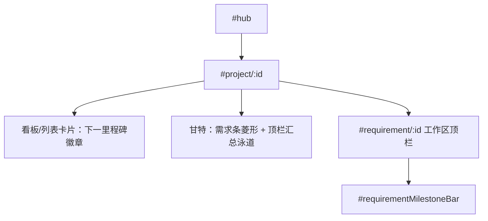

# 需求里程碑 功能方案

> 给实现代理的可执行设计。按第 12 节 PR 顺序落地，不要跳步。
>
> 日期：2026-08-19
> 状态：Approved
> 范围：core、workflow-engine、desktop（Web/Electron）、CLI；OmniPlan 映射仅扩展已规划的导入导出
> 约束：最小改动；不改阶段机 / DAG / Teambition HTTP 契约；不引入 UI 框架或甘特库；沿用现有 vanilla renderer 与 `gantt.js`。

---

## 1. 目标与成功标准

在「项目 ⊃ 需求 ⊃ 节点」之上补一层 **需求级检查点**：每个需求可以挂若干 **单日、零工期** 的命名里程碑（如「PRD 冻结」「设计评审」「UAT 开始」「上线」）。

它解决的问题：

| 现有能力 | 缺口 |
| --- | --- |
| 需求 `plannedStart`/`plannedEnd` 是一段时间条 | 无法标「这一天必须发生」 |
| 节点排期是执行粒度 | 过细，不适合对业务方承诺的检查点 |
| 阶段推进是门控状态机 | 不是日期承诺，也不该被日期改写 |
| OmniPlan 导入把 `type=milestone` 整段 `skipped` | 用户在 OmniPlan 里打的菱形回不来 |

成功标准（全部满足才算完成）：

- 需求上可增删改里程碑：名称 + 日期（`YYYY-MM-DD`）+ 可选阶段/节点挂钩；可标记「已达成」。
- 看板/列表卡片显示最近一个未达成里程碑；过期未达成标红。
- 需求工作区顶栏有里程碑条（下一条 + 添加）。
- 甘特：需求条上叠菱形；展开后有里程碑子行；可拖菱形改日期。
- 项目甘特顶部有一条汇总泳道，收集该项目全部需求里程碑。
- CLI：`octopus milestone list/add/update/reach/delete`。
- OmniPlan 导出写成 `type=milestone` 叶子；导入按 `octopus:milestone:` note 回写日期，不再跳过已映射的 Octopus 里程碑。
- `pnpm test`、`pnpm -r build`、`git diff --check` 通过。

### 非目标

- 不做 **项目级** 跨需求版本/发布里程碑（那是「项目里程碑」，v2）。
- 不把里程碑做成另一种需求（无 workflow DAG、无阶段机、无看板列）。
- 不按阶段自动生成里程碑，不因改 `plannedEnd` 自动插一条「交付」。
- 不把里程碑接入 `advancePhase` / 门控；达成不推进阶段，阶段完成不自动达成。
- v1 不同步 Teambition 里程碑。
- 不改节点 `dependsOn`，里程碑不参与 DAG。
- 不引入新 npm 依赖、不重写 `gantt.js`。

---

## 2. 现状（实现前必须对照）

领域分层已是 `项目 ⊃ 需求`；需求已有 schema v6 排期字段。

| 层级 | 现在 | 与里程碑的关系 |
| --- | --- | --- |
| `WorkflowState` | `plannedStart`/`plannedEnd`，无检查点数组 | 本方案的载体 |
| `StepRuntime` | 节点级排期 | 可选挂钩，不改结构 |
| 阶段机 | `advancePhase` / `rollbackTo` / `moveRequirementPhase` | **禁止**被里程碑调用 |
| 甘特 | `gantt.js` 仅 `kind: "phase" \| "node"`，条形图 | 需加 `kind: "milestone"` 菱形 |
| 项目页 | 仍是卡片墙；看板/甘特 tab 见另一份方案 | 里程碑 UI 挂在卡片、工作区、甘特上 |
| OmniPlan 方案 | 导入跳过 `type=milestone` | 本方案改成「映射到则合并，未映射才 skip」 |
| Teambition | 只绑任务卡片 | v1 不扩 HTTP |

关键文件：

- `packages/core/src/workflow.ts` — `CURRENT_SCHEMA_VERSION = 6`，`RequirementSummary` 无里程碑摘要
- `packages/core/src/branded-ids.ts` — 无 `MilestoneId`
- `packages/core/src/project.ts` — 项目容器，v1 不往这里放里程碑
- `packages/workflow-engine/src/index.ts` — 已有 `updateRequirementSchedule` / `moveRequirementPhase`
- `packages/desktop/src/renderer/gantt.js` — `buildModel` / 拖条 / 未排期托盘
- `packages/desktop/src/renderer/renderer.js` — 项目卡片、`#requirementTbBar`
- `packages/desktop/src/renderer/index.html` — `#projectView`、工作区顶栏
- `packages/cli/src/commands/requirement.ts` — 风格模板
- `docs/plans/teambition-kanban-gantt-omniplan.md` §7.3 — OmniPlan 映射（实现时代码可能尚未落地）

持久化：需求状态整包 JSON 进 `requirements.state_json`，**不必改 SQLite 表**。`migrateWorkflowState` 在 load 时补字段即可。

---

## 3. 关键决策

1. **里程碑属于需求，不属于项目。**
   名称是「需求里程碑」；OmniPlan 里也是需求 group 下的 milestone 叶子。跨需求发布线放到 v2，避免现在把 `Project` 做成第二个聚合根。
2. **独立实体，不是把 `plannedEnd` 画成菱形。**
   时段条与检查点语义不同：一条需求可以有多个检查点，也可以没有检查点但仍有排期。
3. **单日、零工期。**
   只存 `date`，不存 start/end。甘特画菱形，OmniPlan `effort=0` + `type=milestone`。
4. **持久化只有 `planned | reached`；逾期是派生视图。**
   `status === "planned" && date < today` → UI 显示逾期。改日期后自动不再逾期，避免第三种状态和日期打架。
5. **可选挂钩 `phase` / `nodeId`，只作注释，不驱动状态机。**
   方便过滤「设计阶段的检查点」；节点完成后 **不** 自动 `reach`（避免误达；用户显式点达成）。
6. **项目甘特顶部汇总泳道是投影，不是另一份数据。**
   读写仍走所属需求。删除需求则其里程碑一起消失。
7. **OmniPlan：已映射的 milestone 参与往返；无 note 的原生菱形仍 skip。**
   覆盖已有手维护 `.oplx` 的确认框沿用 OmniPlan 方案，不另开一套。
8. **schema 升到 7。** v6→v7 只补 `milestones: []`，不改已有排期字段。

---

## 4. 信息架构



不新增 hash 路由。不把里程碑做成一级 tab。

入口：

| 表面 | 做什么 |
| --- | --- |
| 看板/列表卡片 | 只读徽章；点徽章不进工作区（避免和开卡冲突），hover 列出全部 |
| 工作区顶栏 | 增删改、达成、看下一条 |
| 甘特 | 拖日期、点选、工具条「添加里程碑」 |
| CLI | 全量 CRUD |

---

## 5. 数据模型

### 5.1 新类型

`packages/core/src/milestone.ts`（新文件，保持 `workflow.ts` 不再膨胀）：

```ts
export interface RequirementMilestone {
  id: MilestoneId
  name: string                 // trim 后 1–80 字
  date: string                 // YYYY-MM-DD
  status: "planned" | "reached"
  phase?: Phase                // 可选注释
  nodeId?: string              // 可选挂钩，必须是该需求已有 step.id
  note?: string                // 可选，≤ 500
  createdAt: string            // ISO
  updatedAt: string
  reachedAt?: string           // status=reached 时写入
}

export function isMilestoneOverdue(
  milestone: RequirementMilestone,
  today = todayYmd(),          // 本地日历日
): boolean {
  return milestone.status === "planned" && milestone.date < today
}

export function nextOpenMilestone(
  milestones: readonly RequirementMilestone[],
  today = todayYmd(),
): RequirementMilestone | undefined {
  return [...milestones]
    .filter((m) => m.status === "planned")
    .sort((a, b) => a.date.localeCompare(b.date) || a.createdAt.localeCompare(b.createdAt))[0]
}
```

`packages/core/src/branded-ids.ts` 增加 `MilestoneId` 与工厂，前缀文档用 `ms`。运行时 ID：`ms_${Date.now()}_${random 6}`。

校验（引擎抛中文 `Error`，风格对齐 `updateRequirementSchedule`）：

- `name` 空 / 超 80 → 「里程碑名称必须是 1–80 个字符」
- `date` 非 `YYYY-MM-DD` → 「里程碑日期必须是 YYYY-MM-DD」
- `phase` 非法 → 「未知阶段」
- `nodeId` 非本需求 step → 「节点不存在: …」
- `note` 超 500 → 「备注不能超过 500 个字符」
- 同一需求允许同名或同日多条（不强制唯一）

排序：先 `date` 升序，再 `createdAt`。列表 API 返回已排序副本，不在写入时重排（避免无谓改 JSON）。

### 5.2 `WorkflowState` / `RequirementSummary`

`packages/core/src/workflow.ts`：

```ts
export const CURRENT_SCHEMA_VERSION = 7

export interface WorkflowState {
  // 现有字段...
  milestones?: RequirementMilestone[]
}

export interface RequirementSummary {
  // 现有字段...
  milestoneCount?: number
  nextMilestone?: { id: string; name: string; date: string; overdue: boolean }
}
```

`createEmptyState` 写 `milestones: []`。`listRequirementSummaries` 用 `nextOpenMilestone` 条件展开（与 `plannedStart` 一样，没有就不输出字段）。

`migrateWorkflowState`：任意旧版本升到 7 时，若缺 `milestones` 则补 `[]`。更新 `packages/core/src/migrate.test.ts`（克隆现有 v5→v6 用例）。

### 5.3 项目侧

`Project` **不加** `milestones`。项目汇总 = `listRequirementSummaries(projectId)` 再展开各需求的 `getState().milestones`（引擎提供一次聚合，避免 UI 自己 N+1）。

---

## 6. 引擎 API

全部加在 `packages/workflow-engine/src/index.ts`，测试放 `index.test.ts`。写路径一律 `transactionalUpdate`。

```ts
listMilestones(requirementId: string): RequirementMilestone[]

listProjectMilestones(projectId: string): Array<
  RequirementMilestone & { requirementId: string; requirementName: string }
>

addMilestone(
  requirementId: string,
  input: { name: string; date: string; phase?: Phase; nodeId?: string; note?: string },
): RequirementMilestone

updateMilestone(
  requirementId: string,
  milestoneId: string,
  patch: {
    name?: string
    date?: string | null      // null/"" 非法：v1 日期必填，不能清空
    phase?: Phase | null
    nodeId?: string | null
    note?: string | null
  },
): RequirementMilestone

reachMilestone(requirementId: string, milestoneId: string): RequirementMilestone
// planned → reached，写 reachedAt=now
// 已是 reached → no-op 返回原对象

unreachMilestone(requirementId: string, milestoneId: string): RequirementMilestone
// reached → planned，删除 reachedAt（改期后纠错用）

deleteMilestone(requirementId: string, milestoneId: string): void
```

找不到里程碑：`throw new Error("里程碑不存在: ${id}")`。不新增 Error 子类。

`listProjectMilestones`：按 `date`、再 `requirementName`、再 `id` 排序。项目不存在走现有 `loadProject` 抛错。

不提供「按日期批量达成」。不提供从 `plannedEnd` 一键生成。

---

## 7. OmniPlan 映射（扩展已有方案 §7.3）

在需求 group 下、节点叶子旁导出：

```
t-req-* (group)
  t-ms-*   (task type=milestone, title=里程碑名)
  t-node-* (task)
```

| Octopus | XML |
| --- | --- |
| `name` | `<title>` |
| `requirementId + milestoneId` | `<note>octopus:milestone:{reqId}:{msId}</note>` |
| `date` | `<locked-start-date>{date}T02:00:00.000Z</locked-start-date>` |
| 工期 | `<effort>0</effort>`，`type="milestone"` |
| `status=reached` | v1 **不**写完成度（Octopus 仍是真相源） |

ID：复用 `omniplanIdMap` 键 `milestone:{reqId}:{msId}`；否则 `t-{stableHash}`。

导入：

1. `note` 匹配 `octopus:milestone:` → `updateMilestone(..., { date })`。
2. `idMap` 命中同上。
3. 同父 group 下 title 唯一且 `type=milestone` → 仅当该需求已有同名里程碑时更新日期；否则 **不自动新建**（避免 OmniPlan 里随手打的菱形污染 Octopus）。
4. 无 note、无 idMap、无同名 → `skipped`（保持「未知 milestone 跳过」）。
5. 缺 `locked-start-date` 的已映射里程碑 → `skipped`，**不删** Octopus 日期。

若 OmniPlan I/O 尚未落地：本功能的 integration 改动并入那份方案的 PR2，或紧随其后的小 PR，不要另写一套 zip/xml。

---

## 8. UI

风格继续用 `--el-*`、`.hub-card`、`.tb-bar`。不引库。

### 8.1 工作区顶栏

`index.html` 在 `#requirementTbBar` 旁加 `#requirementMilestoneBar.tb-bar`：

```
里程碑  设计评审 03-12  ·  上线 04-01（逾期）     [+ 添加]
```

- 最多展示 3 条未达成（按日期）；其余收进「还有 N 个」。
- 已达成默认折叠，用「已达成 N」展开。
- 「添加」弹现有风格的小表单：名称、日期、可选阶段下拉、可选节点下拉、备注。
- 点击一条：改日期/名称，或「标记达成 / 取消达成 / 删除」。删除二次确认。
- 窄屏：只显示下一条 + 添加。

### 8.2 看板 / 列表卡片

在现有卡片 meta 行加：

- 无里程碑：不渲染（不要「未设里程碑」占位）。
- 有未达成：`里程碑 03-12 设计评审`；逾期加 `is-overdue`（红字）。
- 仅已达成：`里程碑已全部达成`（muted）。

`buildRequirementCardsMarkup`（及后续 `buildKanbanMarkup`）读 `summary.nextMilestone` / `milestoneCount`。`web.test.ts` 抽函数单测：无 / 下一条 / 逾期 / 全达成。

### 8.3 甘特

`gantt.js` 扩展，不新组件：

**nodes 模式（列表「排期」与工作区）：**

- 在 phase 组之前插一组 `kind: "milestones"` 头行 + 每条 `kind: "milestone"` 子行。
- 子行左侧：◇ 名称；日期列只显示一个日期（开始=结束=date）；状态列 `计划中` / `已达成` / `逾期`。
- 图上画菱形（边长 10px 的旋转方，描边 2px）。已达成实心主色，计划中空心，逾期红色。
- 拖菱形只改 `date`（吸附日历日，与现有拖条同一套 `parseDate`）。
- 无里程碑则不插这个组。

**requirements 模式（项目甘特 tab，若已存在）：**

- 需求条上按各 milestone.date 叠菱形；点菱形 `onSelect({ kind:"milestone", requirementId, id })`。
- 展开需求行后，节点之前插入里程碑子行。
- 图顶部固定一行 `kind: "project-milestones"`：该项目全部菱形（同日多条纵向微错开 6px）。只读投影，拖拽仍写回所属需求。

回调：

```js
onSchedule(id, schedule, kind)
// kind === "milestone" 时 schedule 为 { date }，id 为 milestoneId
// 项目模式再带 requirementId

onReach?(requirementId, milestoneId)
```

工具条在「依赖线」后加「添加里程碑」（工作区/列表排期语境下对当前需求；项目甘特需先选中需求行，否则 `statusEl` 提示「请先选中一个需求」）。

未排期托盘 **不** 放里程碑（日期必填）。

同一时间仍只 mount 一个 `OctopusGantt`。

### 8.4 新 RPC

`browser-api.js` + `web.ts` + `main.ts` 同步：

- `listMilestones(requirementId)`
- `listProjectMilestones(projectId)`
- `addMilestone(requirementId, input)`
- `updateMilestone(requirementId, milestoneId, patch)`
- `reachMilestone` / `unreachMilestone`
- `deleteMilestone`

`web.test.ts` 断言 API 字符串存在（与现有 `updateRequirementSchedule` 用例相同）。

---

## 9. CLI

新建 `packages/cli/src/commands/milestone.ts`，挂到 `index.ts`，风格抄 `requirement.ts`。

```
octopus milestone list <requirementId> [--json] [--all]
octopus milestone add <requirementId> --name <name> --date YYYY-MM-DD
    [--phase Phase] [--node <nodeId>] [--note <text>] [--json]
octopus milestone update <milestoneId> --requirement <id>
    [--name] [--date] [--phase] [--node] [--note] [--json]
octopus milestone reach <milestoneId> --requirement <id> [--json]
octopus milestone unreach <milestoneId> --requirement <id> [--json]
octopus milestone delete <milestoneId> --requirement <id> --yes
octopus milestone project <projectId> [--json]
```

`--all` 包含已达成；默认只列 `planned`。人读输出示例：

```
设计评审   2026-03-12  planned   Design
上线       2026-04-01  overdue
```

`packages/cli/src/cli.test.ts` 覆盖解析与一次 add→list→reach→delete。

---

## 10. 测试矩阵

| 包 | 用例 |
| --- | --- |
| `core` | schema 7 迁移补 `[]`；已有 milestones 不丢；`isMilestoneOverdue` / `nextOpenMilestone`（空、全达成、逾期优先按日期） |
| `workflow-engine` | add 校验；update 改期；reach/unreach；delete；挂钩非法 nodeId；`listProjectMilestones` 跨需求排序 |
| `desktop/web.test.ts` | 新 RPC；卡片徽章三种状态 |
| `cli` | 子命令解析 + 假 store 往返 |
| `integration`（若 OmniPlan 已存在） | milestone note 往返；未知 milestone 仍 skip；缺日期不清除 |

手工（`pnpm web`）：

1. 工作区添加两条，一条改到昨天 → 顶栏逾期。
2. 达成后徽章变「已全部达成」或下一条前移。
3. 甘特拖菱形，刷新日期仍在。
4. 若 OmniPlan 已落地：导出后 Actual.xml 含 `type="milestone"`，改日期再导入。

无浏览器自动化时以 vitest + 上述手工为准。

---

## 11. 风险与备选

| 风险 | 级别 | 缓解 |
| --- | --- | --- |
| 和「项目里程碑」预期不符 | 中 | 文档写清；v2 再做跨需求发布线 |
| 用户以为达成会推进阶段 | 中 | UI 文案「标记达成」旁不出现阶段名动作；帮助句「不会改变需求阶段」 |
| 甘特菱形与条重叠难点 | 中 | 菱形画在条上方 6px；命中盒 16×16 |
| OmniPlan 方案未落地时本功能卡死 | 低 | OmniPlan 映射可后置，引擎/UI/CLI 不依赖 zip |
| 与进行中的看板/甘特 PR 抢 `gantt.js` | 中 | 甘特部分排在项目甘特 tab 之后，或同一 PR 内按文件分段 |

已否决：

1. **项目级实体 + 需求外键** — 名称不符，还要改 `Project` 聚合与删除级联。
2. **`plannedEnd` 即里程碑** — 一条需求只能有一个检查点，且与时段条冲突。
3. **里程碑当看板列** — 列已是 `PHASE_ORDER`。
4. **节点完成自动 reach** — 挂钩只是注释，自动达成容易误伤。
5. **新表存里程碑** — 破坏需求 JSON 聚合，得不偿失。

---

## 12. PR Plan

文档先入 `docs/plans/`。实现不要把后续 PR 的重构提前做进前面。

### PR1 — chore(docs): 写入需求里程碑方案

- 文件：`docs/plans/requirement-milestones.md`；README「图形界面」段加一句入口
- 依赖：无
- 不改代码

### PR2 — feat(core): 需求里程碑模型与引擎 CRUD

- 文件：`packages/core/src/milestone.ts`、`branded-ids.ts`、`workflow.ts`、`index.ts`、`migrate.test.ts`；`packages/workflow-engine/src/index.ts`、`index.test.ts`
- 依赖：PR1
- schema 7、六个引擎方法、`RequirementSummary` 摘要
- 测：`pnpm --filter @octopus/core test`、`workflow-engine`
- 不改 UI

### PR3 — feat(cli): milestone 子命令

- 文件：`packages/cli/src/commands/milestone.ts`、`index.ts`、`cli.test.ts`
- 依赖：PR2

### PR4 — feat(desktop): 工作区顶栏 + 卡片徽章 + RPC

- 文件：`browser-api.js`、`web.ts`、`main.ts`、`web.test.ts`、`index.html`、`renderer.js`
- 依赖：PR2
- 可与 PR3 并行
- 此步 **先不改** `gantt.js`（避免和项目甘特 PR 打架）

### PR5 — feat(desktop): 甘特菱形 + 项目汇总泳道

- 文件：`gantt.js`、`renderer.js`、`index.html`（必要的 CSS）
- 依赖：PR4；若 `docs/plans/teambition-kanban-gantt-omniplan.md` 的项目甘特 tab 已合入则叠在 `mode: "requirements"` 上，否则只做 nodes 模式 + 顶栏泳道可延后
- 验：列表「排期」旧路径回归；只 mount 一个实例

### PR6 — feat(integration): OmniPlan milestone 往返

- 文件：`packages/integration/src/omniplan.ts` 及测试、引擎 import/export
- 依赖：PR2 + OmniPlan I/O 已存在
- 若 OmniPlan PR 尚未开始：本 PR 并入那份方案的 PR2，不单独占位

每 PR：

```bash
pnpm test
pnpm -r build
git diff --check
```

### 实现时禁止

- 不要在 `reachMilestone` 里调用 `advancePhase`。
- 不要给 `moveRequirementPhase` 加「按里程碑跳列」。
- 不要往 `Project.metadata` 塞里程碑 JSON。
- 不要新增 UI 框架或甘特库。
- 不要提交用户真实 OmniPlan 工程文件。
- 不要顺手改 `workflow.yaml` / 阶段顺序。

---

## 13. 实现代理开工检查清单

1. 先读本文件 + `workflow.ts` / `gantt.js` / `teambition-kanban-gantt-omniplan.md` §7.3。
2. 先文档 PR，再代码。
3. 每个引擎方法先补测试再实现。
4. UI 先工作区顶栏和卡片，后甘特。
5. 自测：非法日期、挂钩不存在的 node、重复 reach、删除需求后汇总泳道消失。
6. 工作区有未提交的看板/甘特 WIP 时，不要重排无关 diff。

---

## 14. Open Questions

无阻塞问题。若产品日后要「一条发布线挂多个需求」，另开「项目里程碑」方案，不要改本模型的归属。
