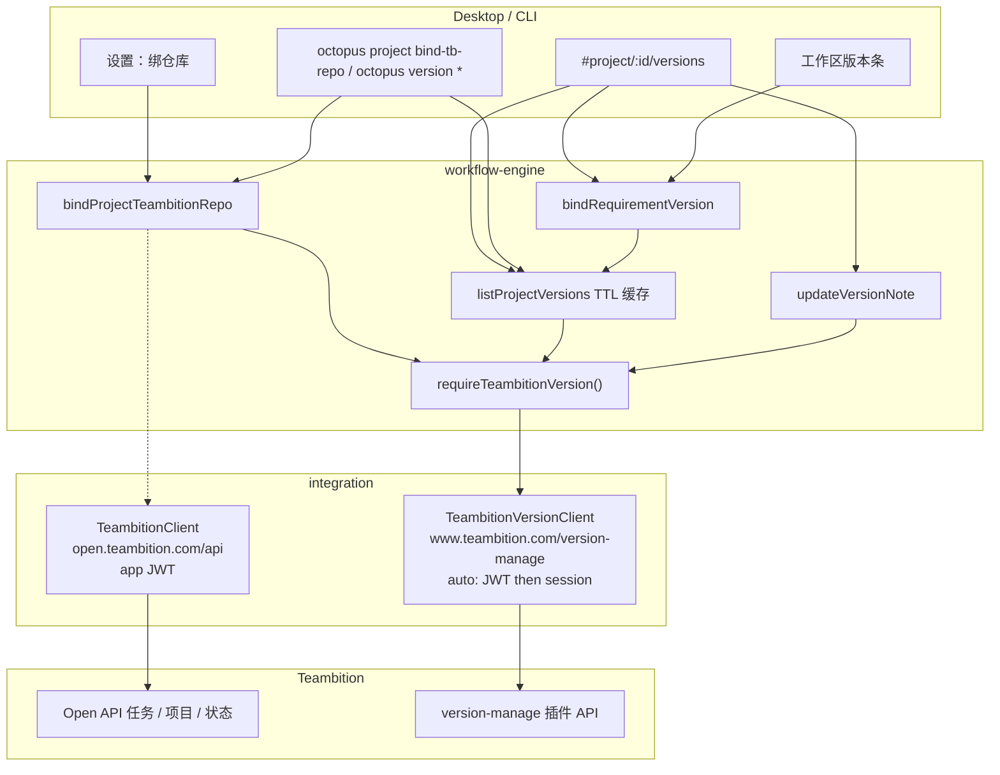
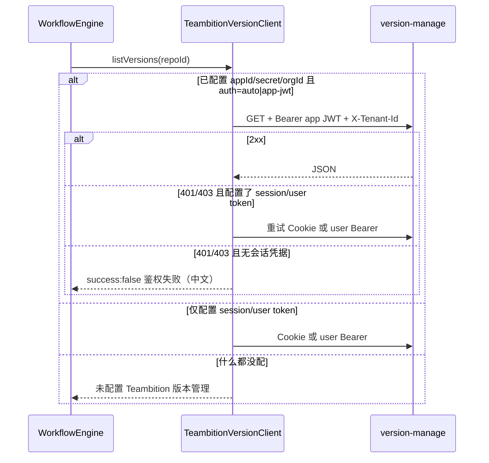
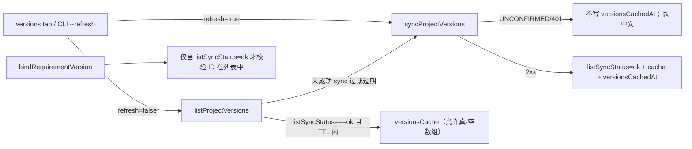

# Teambition 版本计划对接

> 给 DeepSeek（或其它实现代理）的可执行设计。按第 19 节执行手册与第 20 节 PR 顺序落地，不要跳步。
>
> **禁止**把 `case/updateNote.md` / `case/createBranch.md` 里的真实 cookie、token、工程 ID 写进代码或测试夹具。
> **禁止**把未确认的 version-manage 列表/详情端点写成已经能用。第一个代码 PR 必须先做契约探针 + 脱敏 fixture + 客户端骨架。
> 引擎 / CLI / UI **只**调用客户端方法，禁止自己拼 `www.teambition.com/version-manage` URL。

日期：2026-08-19  
作者：待定  
状态：Draft  
范围：integration、core、workflow-engine、context、CLI、desktop（Web/Electron）  
约束：最小改动；沿用 vanilla renderer、现有 `IntegrationResult`、现有任务 Open API 契约；不引入新 npm 依赖或 UI 框架。

落地仓库路径（文档 PR 写入）：`docs/plans/teambition-version-plan.md`

---

## 1. Overview

Octopus 已经能把项目绑到 Teambition **任务项目**、把需求绑到 **任务卡片**，但完全没有「版本 / 发布计划」概念。用户在 Teambition 版本管理插件里维护仓库与版本（含 note 里的企微文档链接），Octopus 侧无法列出这些版本，也无法把多条需求挂到同一个发布版本上。

本方案增加并列的 **版本计划（Version Plan）**：

1. 项目绑定一个 TB **版本仓库**（`repoId` + 可选 `pluginId`），与现有 `Project.teambition`（任务项目）互不替代。
2. 列出 / 刷新该仓库下的版本（名称、时间窗、状态、note、url）。
3. 把 Octopus 需求挂到某个 TB 版本（多对一；一条需求同一时刻最多一个版本）。
4. 读 / 写版本 note（**唯一已确认**的 HTTP 写契约：`PUT .../note`）。
5. 项目设置卡片 + 项目页「版本」tab + 工作区版本条 + CLI。

鉴权与任务 Open API **分叉**：任务走 `https://open.teambition.com/api` 的 app JWT；版本管理走 `https://www.teambition.com/version-manage` 的插件 API。必须独立客户端，且 **第一个代码 PR 只做探针与骨架**，未确认端点必须返回明确失败，禁止假装成功。

---

## 2. Background & Motivation

### 2.1 为什么现在做

需求里程碑方案（`docs/plans/requirement-milestones.md`）明确把「项目级跨需求版本 / 发布里程碑」列为非目标，并写「v1 不同步 Teambition 里程碑」。业务上已经有一份真相源：Teambition 版本管理插件里的仓库 / 版本 / note。继续把发布线塞进需求里程碑会污染两个模型。

当前痛点：

| 能力 | 现在 | 缺口 |
| --- | --- | --- |
| 任务项目绑定 | `Project.teambition` + `bindProjectTeambition` | 只服务任务卡片 |
| 任务卡片绑定 | `RequirementTeambitionBinding` | 与发布版本无关 |
| 需求里程碑 | `WorkflowState.milestones[]` | 单日检查点，不是跨需求发布线 |
| Git 发版分支 | `GitClient.createReleaseBranch` → `release/${version}` | 本机 git，与 TB 版本无关联 |
| 版本仓库 / note | 无 | 用户只能在浏览器里改 note |

### 2.2 现状（实现前必须对照的事实）

| 层级 | 现在 | 与本方案的关系 |
| --- | --- | --- |
| `TeambitionClient` | 只打 `gatewayBase`（默认 `https://open.teambition.com/api`），JWT claim `_appId`，头 `Authorization: Bearer` + `X-Tenant-Id` + `X-Tenant-Type: organization` | **禁止**把 version-manage 路径塞进 `request()` |
| `TeambitionIntegration` | `resolveProject` / `resolveTask` / `updateTask` / `projectStatuses` / `taskChildren` / `myTasks` / `searchMembers` | 保持签名与行为不变 |
| `ProjectTeambitionBinding` | `{ projectId, name?, uniqueIdPrefix? }` | 继续只表示任务项目 |
| `RequirementTeambitionBinding` | `{ taskId, taskRef, statusId, statusName, url, lastSyncedAt }` | 继续只表示任务卡片 |
| schema | `CURRENT_SCHEMA_VERSION = 8`（owner） | 本方案升到 9 |
| 引擎 | `bindProjectTeambition` / `unbindProjectTeambition` / `listTeambitionCardStatuses` / `bindRequirementTask` / `unbindRequirementTask` / `getRequirementTeambitionStatus` / `updateRequirementTeambitionStatus` | 并列新增版本方法；`unbind*` **不得**误删版本绑定 |
| CLI | `octopus project bind-tb\|unbind-tb\|tb-statuses`；`octopus requirement bind-task\|tb-status\|tb-update` | 风格对齐，另开 `octopus version` |
| UI | 设置页 TB 项目绑定；看板卡片任务 `<select>`；工作区 `#requirementTbBar`。拖看板不写 TB | 新 tab「版本」+ 设置卡片 + 工作区版本条。拖看板仍不写 TB / 版本 |
| 配置 | `.octo/config.json` `teambition` 或 `OCTOPUS_TB_APP_ID/SECRET/ORG_ID/OPERATOR_ID/GATEWAY/REF_STRATEGY` | 扩展可选 version-manage 凭据，不改任务网关 |
| 持久化 | SQLite `projects.state_json` / `requirements.state_json` 整包 JSON | **不必改表** |
| GitLab 抓包 | `case/createBranch.md` 是网页 POST `prerelease/20260716.01-daily` | v1 **不接** |

关键文件：

- `packages/integration/src/teambition.ts` — 保持任务契约；**不要**改 `gatewayBase` 默认值
- `packages/integration/src/index.ts` — `TeambitionIntegration` 不加版本方法
- `packages/core/src/project.ts` / `workflow.ts` / `migrate.test.ts`
- `packages/context/src/index.ts` — `SqliteStateStore` 把 `Project` / `WorkflowState` 整包进 `state_json`
- `packages/workflow-engine/src/index.ts` — `requireTeambition()` 只认 `integrations["teambition"]` 且 `instanceof TeambitionClient`
- `packages/context/src/config.ts`
- `packages/desktop/src/web.ts` / `main.ts` / `renderer/browser-api.js` / `renderer/renderer.js`（`renderProjectSettings`、`routeFromHash`、`refreshRequirementTbBar`）
- `packages/desktop/src/renderer/index.html` — `.project-tabs` 现为 看板 / 列表 / 甘特 / 设置
- `packages/cli/src/commands/project.ts` / `requirement.ts` / `index.ts`
- `case/updateNote.md` — **唯一已捕获**的版本 HTTP 样本（浏览器会话，不是 Open API）
- `docs/plans/requirement-milestones.md`、`docs/plans/teambition-kanban-gantt-omniplan.md`

### 2.3 已确认 vs 未确认的外部 API

#### 已确认（CONFIRMED）

来源：`case/updateNote.md`（浏览器抓包）。只确认「路径形状 + 方法 + JSON body 键 + 业务头 + Referer」。

**抓包里没有 `Cookie` 头，也没有 `Authorization`。** PUT 的 **鉴权方式本身是 UNCONFIRMED**（JWT / 会话 / 是否必须 Referer 都要探针）。禁止把「抓包含浏览器 Cookie」写进实现注释。

```
PUT https://www.teambition.com/version-manage/api/v1/repositories/{repoId}/versions/{versionId}/note
Headers:
  x-request-id: <uuid>
  x-timezone: 8
  x-tenant-id: <orgId>
  accept: application/json
  Content-Type: application/json
  （无 Cookie、无 Authorization、无 X-Tenant-Type）
Referer:
  https://www.teambition.com/project/{tbProjectId}/plugin/{pluginId}/repo/{repoId}/version/{versionId}
Body:
  { "note": "<string，可为企微文档 URL>" }
```

样本 ID **仅作结构参考**，禁止当默认值、禁止进 fixture：

- TB project `5ed77da84d9f550021c1dd88`
- plugin `66827e547ecd42002b015ad3`
- repo `5f06b7255c00c934f6cb0761`
- version `6a31fd31ba6edd8cf540470f`
- tenant `5a30c1688a4d91000158ce4f`

响应 JSON **未捕获**。客户端必须按「HTTP 2xx + 尽力 parse」处理；解析失败仍可 `success: true` 并回传 `{ note }`。

#### 未确认（UNCONFIRMED）

下列端点是按 REST 习惯与 Referer 路径 **猜测** 的，实现前必须经 PR1 探针验证。未验证前，对应方法必须返回：

```
{ success: false, message: "Teambition 版本列表端点尚未确认（需先跑契约探针）", error: "UNCONFIRMED_ENDPOINT" }
```

禁止 200 空数组、禁止抛英文 stack 当成功。

| # | 猜测 | 用途 | 如何验证 |
| --- | --- | --- | --- |
| U1 | `GET /version-manage/api/v1/repositories/{repoId}/versions` | 列出版本 | 200 + 数组则录 fixture；401/403 记鉴权失败；404 记路径错 |
| U2 | `GET /version-manage/api/v1/repositories/{repoId}/versions?pageSize=50` | 分页变体 | 同上 |
| U3 | `GET /version-manage/api/v1/repositories/{repoId}/versions/{versionId}` | 版本详情 | 同上 |
| U4 | `GET /version-manage/api/v1/repositories/{repoId}` | 仓库详情 | 同上 |
| U5 | `GET /version-manage/api/v1/projects/{tbProjectId}/repositories` | 按 TB 项目列仓库 | 同上 |
| U6 | `GET /version-manage/api/v1/projects/{tbProjectId}/plugins/{pluginId}/repositories` | 按插件列仓库 | 与 Referer 结构最接近 |
| U7 | `GET https://open.teambition.com/api/v3/...` 任意 version/repo | Open API 是否覆盖版本插件 | 全 404/无权限则放弃，**不要**把 version-manage 塞进 `TeambitionClient` |
| U8 | `POST /version-manage/api/v1/repositories/{repoId}/versions` | 创建版本 | v1 **不实现**；探针只记录是否存在 |
| U9 | 把 Octopus 需求 / TB 任务挂到版本的官方关联 API | 远端关联 | v1 **不做**；关联只存在 Octopus 本地 |

探针脚本、脱敏规则、fixture 目录见 §5.4。

---

## 3. Goals & Non-Goals

### 3.1 目标与成功标准

全部满足才算完成：

1. 项目可绑定 / 解绑 Teambition 版本仓库（`repoId` 必填，`pluginId` / `tbProjectId` 选填但写 url 时需要）。
2. 已绑定仓库可列出 / 刷新版本；仅 `listSyncStatus === "ok"` 且 TTL 内走本地缓存；手动刷新必打远端。UNCONFIRMED 不得返回空成功。
3. 需求可绑定 / 解绑一个版本；同一需求再绑会覆盖；解绑任务 **不影响** 版本绑定。
4. 可读 / 写版本 note（路径/body 已确认的 PUT；鉴权仍按 `auto` spike）。空 note 允许（清空说明）。
5. 未配置版本凭据时，CLI / UI 走 `readableError` 风格中文错误，进程 / 页面不崩溃。
6. 项目页深链 `#project/:id/versions`；设置页有独立「版本仓库」卡片；工作区有版本条。
7. CLI：`octopus project bind-tb-repo|unbind-tb-repo` 与 `octopus version list|show|sync|default|bind|unbind|note|members|show-req`。`octopus -V` / `--version` 仍是 Commander 包版本（`0.1.0`）；裸 `octopus version` 显示该子命令 help，不是包版本。
8. `pnpm test`、`pnpm -r build`、`git diff --check` 通过。
9. 全部 HTTP 测试 mock `fetch`；不提交真实 Dior / PRC / cookie / token。
10. Web 仍只监听 `127.0.0.1`。

### 3.2 非目标（v1 写死）

- 不把 TB 版本状态机映射成 Octopus `currentPhase`。
- 不把看板列改成版本；拖看板 **不** 写 TB 任务或版本。
- 不因 `advancePhase` / `rollbackTo` / `moveRequirementPhase` 改 TB 版本。
- 不把需求里程碑同步到 TB，也不把 TB 版本改造成需求里程碑。两者并存。
- 不创建 / 删除 TB 版本（U8），即使探针发现 POST。
- 不把需求 / 任务写回 TB 版本的「关联工作项」（U9）。**即使用户探针探通 U9，本迭代也不 POST。**
- 不抓取浏览器 cookie 当默认真源；会话凭据只能显式配置，README 必须警告。
- 不对接 GitLab 网页建分支（`case/createBranch.md`）。**不因绑定版本或写 note 调用 `createReleaseBranch`。** `createReleaseBranch` 保持 `release/${version}`。禁止 GitLab cookie。
- 设置页 **不做** 版本仓库选择器；一个 Octopus 项目只手填绑定一个 `repoId`（U5/U6 返回多个也忽略）。
- 不改现有 `TeambitionClient.request()` 的 `gatewayBase` 默认路径，不加 version 方法到 `TeambitionIntegration`。
- 不引入新 npm 依赖、不引入 React/Vue、不重写 `gantt.js`。
- 不改阶段机 / DAG / `workflow.yaml`。

---

## 4. Key Decisions

1. **独立 `TeambitionVersionClient`，不要把方法加进现有 `TeambitionClient`。**  
   任务 Open API 与 version-manage 的 host、路径前缀、鉴权、错误体都不同。现有 `request()` 会把 path 拼到 `https://open.teambition.com/api`，混进去会破坏任务契约，也会让 `instanceof TeambitionClient` 的引擎装配变脏。版本客户端注册为 `integrations["teambition-version"]`。

2. **鉴权 `auto`：先 spike 同一套 app JWT，失败再可选会话。**  
   优先 `Authorization: Bearer <HS256 _appId JWT>` + `X-Tenant-Id` + `X-Tenant-Type: organization` 打 version-manage。401/403 且配置了 `sessionCookie` / `userAccessToken` 时重试一次。两种都没有则中文失败。**禁止**把抓包 cookie 写进默认实现或测试。

3. **项目级用新字段 `Project.teambitionVersion`，不扩展 `ProjectTeambitionBinding`，不塞 `metadata`。**  
   `unbindProjectTeambition` 今天是 `delete current.teambition`。若把 repo 塞进同一个对象，解绑任务项目会误删版本仓库。`metadata` 已承担 OmniPlan / BRD 字符串补丁，不适合结构化绑定。SQLite 项目是整包 JSON，加可选字段无需改表。

4. **需求级用新字段 `WorkflowState.teambitionVersion`，不往 `RequirementTeambitionBinding` 加 `versionId`。**  
   `unbindRequirementTask` 今天是 `delete current.teambition`。任务与版本正交：可以只绑版本、不绑任务。schema 升到 9。

5. **版本列表缓存在项目绑定上，TTL 5 分钟，且只有「成功 sync」才算新鲜。**  
   打开设置 / 版本 tab 不应每次打 TB。缓存挂在 `versionsCache` + `versionsCachedAt` + `listSyncStatus`。UNCONFIRMED / 401 **不得**写 `versionsCachedAt`，**不得**把空数组当成成功列表。需求绑定只存 `versionId` + 展示用快照（name/url）。

6. **关联是 Octopus 本地外键，不是 TB 远端关联（用户 2026-08-19 锁定）。**  
   「需求属于某版本」只写 `WorkflowState.teambitionVersion`。v1 **不** POST 到 Teambition。U9 即使探通也不在本迭代实现。

7. **第一个代码 PR 只交付探针 + 脱敏 fixture + 客户端骨架。**  
   未确认方法固定返回 `UNCONFIRMED_ENDPOINT`。后续引擎 / UI 依赖稳定方法签名，不依赖具体 URL。

8. **CLI 命名对齐现有 `bind-tb` / `milestone`。**  
   仓库绑定挂在 `octopus project`（与 `bind-tb` 并列）；版本 CRUD 挂独立顶级 `octopus version`（与 `octopus milestone` 并列），避免 `project` 子命令继续膨胀。

9. **UI 加一级 tab「版本」，不新框架。**  
   `#project/:id/versions`。设置页只负责绑仓库。工作区加 `#requirementVersionBar`，风格抄 `#requirementTbBar`。

10. **版本不驱动 git 分支（用户 2026-08-19 锁定）。**  
    `createReleaseBranch` 保持 `release/${version}`。不因绑版本或写 note 建分支。禁止 GitLab cookie。

11. **一个 Octopus 项目只绑一个 TB 版本仓库（用户 2026-08-19 锁定）。**  
    设置页手填单个 `repoId`，不做仓库选择器。探针 U5/U6 即使返回多个，仍只存当前绑定的那一个。

---

## 5. Proposed Design

### 5.1 架构



任务流（左）与版本流（右）在引擎里是两套 `require*`，互不调用。`createWorkflowEngineFromConfig` 可以只装任务客户端、只装版本客户端、或两个都装。

### 5.2 鉴权分叉



实现约束：

- JWT 签名函数 **复制** `teambition.ts` 的 `signAppToken` 到 `teambition-version.ts`（或抽 `teambition-auth.ts` 仅含 b64 + HMAC）。**不要**让 VersionClient 依赖 `TeambitionClient` 实例。
- `versionAuth` 默认 `"auto"`。
- `sessionCookie` 原样放进 `Cookie` 头，不要 URL-encode，不要日志打印。
- `userAccessToken` 走 `authorization: Bearer <token>`（与 app JWT 互斥于同一次请求）。头名用 **小写 `authorization`**，与现有 `TeambitionClient.authHeaders()` 一致。JWT 测试读 `headers.authorization ?? headers.Authorization`。
- 每次请求生成 `x-request-id`（`crypto.randomUUID()`）。
- 固定 `x-timezone: 8`、`accept: application/json`、`content-type: application/json`。
- `X-Tenant-Id` 用 `orgId`（与任务客户端同一租户）。
- `X-Tenant-Type: organization` **只在 app JWT 请求上发**（Open API 习惯）。抓包 PUT 没有该头，会话请求不要加。
- 能用 `buildVersionUrl` 拼出页面 URL 时，PUT/GET 都带 `Referer`（抓包有此头）。拼不出则省略；若随后 403，错误文案要求补 `pluginId` + `tbProjectId`。
- 会话模式 **不** 伪造 Chrome UA / sec-ch-*；只发业务头。
- timeout 复用 `timeoutMs`，默认 15_000。
- 所有错误字符串必须经过 `redactSecrets(text)`：去掉已配置的 `sessionCookie`、`userAccessToken`、`appSecret` 字面量，以及 `Cookie:` / `authorization:` 行。截断 300 字。测试断言 401 body 含 cookie 时 `result.error` / `result.message` **不含**该 cookie。

### 5.3 客户端骨架（PR1 就必须定死的签名）

新文件：`packages/integration/src/teambition-version.ts`

```ts
export type TbVersionAuthMode = "auto" | "app-jwt" | "session" | "user-token"

export interface TeambitionVersionConfig {
  appId?: string
  appSecret?: string
  orgId?: string
  versionManageBase?: string          // 默认 https://www.teambition.com
  sessionCookie?: string
  userAccessToken?: string
  versionAuth?: TbVersionAuthMode     // 默认 auto
  timeoutMs?: number                  // 默认 15000
}

export interface TbVersion {
  versionId: string
  repoId: string
  name: string
  status?: string
  startDate?: string                  // 原样字符串，不做 TZ 换算
  endDate?: string
  note?: string
  url?: string                        // 由 buildVersionUrl 填
  raw?: unknown                       // 仅测试 / 探针；引擎不要依赖
}

export interface TbVersionRepository {
  repoId: string
  name?: string
  pluginId?: string
  tbProjectId?: string
}

export function buildVersionUrl(ids: {
  tbProjectId?: string
  pluginId?: string
  repoId: string
  versionId: string
}): string | undefined

/** 从 JSON 抽出版本数组。候选信封：自身即数组，或 result / data / items / versions，或 result.list / data.list。 */
export function unwrapVersionList(json: unknown): unknown[]

export function mapVersion(raw: unknown, repoId: string): TbVersion | null

export function redactSecrets(text: string, secrets: string[]): string
export function sanitizeFixture(value: unknown): unknown

export const VERSION_LIST_ENDPOINT: "unconfirmed" | "confirmed" = "unconfirmed"
export const VERSION_LIST_PATH = "/version-manage/api/v1/repositories/:repoId/versions"
export const VERSION_DETAIL_ENDPOINT: "unconfirmed" | "confirmed" = "unconfirmed"
export const VERSION_DETAIL_PATH = "/version-manage/api/v1/repositories/:repoId/versions/:versionId"
export const VERSION_REPO_ENDPOINT: "unconfirmed" | "confirmed" = "unconfirmed"
export const VERSION_REPO_PATH = "/version-manage/api/v1/repositories/:repoId"
export const VERSION_REPO_LIST_ENDPOINT: "unconfirmed" | "confirmed" = "unconfirmed"
export const VERSION_REPO_LIST_PATH = "/version-manage/api/v1/projects/:tbProjectId/plugins/:pluginId/repositories"

export class TeambitionVersionClient {
  readonly name = "teambition-version"
  constructor(config: TeambitionVersionConfig)

  healthCheck(): Promise<IntegrationResult>
  // UNCONFIRMED until 对应常量 === "confirmed"
  listRepositories(query: { tbProjectId?: string; pluginId?: string }): Promise<IntegrationResult>
  getRepository(repoId: string): Promise<IntegrationResult>
  listVersions(repoId: string): Promise<IntegrationResult>
  getVersion(repoId: string, versionId: string): Promise<IntegrationResult>
  // 路径/body CONFIRMED；鉴权 UNCONFIRMED
  updateVersionNote(
    repoId: string,
    versionId: string,
    note: string,
    ids?: { tbProjectId?: string; pluginId?: string },
  ): Promise<IntegrationResult>
}

export function createTeambitionVersionClient(config: TeambitionVersionConfig): TeambitionVersionClient
```

`buildVersionUrl`：四个 ID 齐才返回  
`https://www.teambition.com/project/${tbProjectId}/plugin/${pluginId}/repo/${repoId}/version/${versionId}`，否则 `undefined`。  
这是 **TB 网页 URL**，host 写死 `www.teambition.com`，**不要**用 `versionManageBase`（那是 API origin，可被测服覆盖）。

每个 GET 方法看 **自己的** `*_ENDPOINT` 常量：`"unconfirmed"` 时 **零次 fetch**，返回对应中文 `UNCONFIRMED_ENDPOINT`。探针补丁只把实际 2xx 的那几个常量改为 `"confirmed"` 并改 path。

`TeambitionVersionIntegration` 新接口（`packages/integration/src/index.ts`），**不要**往 `TeambitionIntegration` 加方法：

```ts
export interface TeambitionVersionIntegration extends IntegrationService {
  listRepositories(query: { tbProjectId?: string; pluginId?: string }): Promise<IntegrationResult>
  getRepository(repoId: string): Promise<IntegrationResult>
  listVersions(repoId: string): Promise<IntegrationResult>
  getVersion(repoId: string, versionId: string): Promise<IntegrationResult>
  updateVersionNote(
    repoId: string,
    versionId: string,
    note: string,
    ids?: { tbProjectId?: string; pluginId?: string },
  ): Promise<IntegrationResult>
}
```

导出：`TeambitionVersionClient`、`createTeambitionVersionClient`、`buildVersionUrl`、`unwrapVersionList`、`mapVersion`、`redactSecrets`、`sanitizeFixture`、四个 `*_ENDPOINT` / `*_PATH` 常量及上述类型。

#### 未配置 / 错误文案（必须按此字符串测）

| 条件 | `IntegrationResult` |
| --- | --- |
| 无 app 三件套且无 session/user token | `{ success: false, message: "Teambition 版本管理未配置（缺少 app JWT 或会话凭据）" }` |
| 方法对应端点未确认 | `{ success: false, message: "Teambition 版本列表端点尚未确认（需先跑契约探针）", error: "UNCONFIRMED_ENDPOINT" }`（`getVersion` 文案把「列表」换成「详情」；`listRepositories` / `getRepository` 换成「仓库」） |
| JWT 与会话都 401/403 | `{ success: false, message: "Teambition 版本管理鉴权失败（app JWT 与会话均被拒绝）", error: message }` |
| HTTP 非 2xx（已确认 PUT note） | `{ success: false, message: "更新版本说明失败: TB ${status} PUT /note: ${text.slice(0,300)}", error }` |
| `repoId` / `versionId` 空 | `{ success: false, message: "repoId 不能为空" }` / `"versionId 不能为空"` |
| `note` 非字符串 | `{ success: false, message: "note 必须是字符串" }`（允许 `""`） |

`healthCheck`（**禁止**用 `success: true` 表示「凭据在、端点未知」——`checkIntegrationHealth` 会把它画成绿灯）：

| 条件 | 返回 |
| --- | --- |
| 无 JWT 三件套且无 session/user token | `{ success: false, message: "Teambition 版本管理未配置（缺少 app JWT 或会话凭据）" }` |
| `VERSION_LIST_ENDPOINT === "unconfirmed"`（有凭据） | `{ success: false, message: "Teambition 版本管理凭据已配置，但远端列表端点尚未确认（需先跑契约探针）" }`。**零次 fetch。** |
| 列表已确认 | 发一次 `GET`：path 含 `:repoId` 时改探 `GET {versionManageBase}/version-manage/api/v1/`（不要用假 repoId）。任意 HTTP 响应且非 401/403 → `{ success: true, message: "Teambition 版本管理 API 可达" }`；401/403 → 鉴权失败中文；网络错误 → `Teambition 版本管理不可用: …`。 |

这 **不是** U4（U4 是 `GET …/repositories/{repoId}`）。未确认阶段不要打任何 GET。

#### `updateVersionNote`（路径/body CONFIRMED；鉴权 UNCONFIRMED；PR1 就必须实现）

```
PUT {versionManageBase}/version-manage/api/v1/repositories/{encodeURIComponent(repoId)}/versions/{encodeURIComponent(versionId)}/note
Body: { "note": note }
```

额外：`ids` 能拼出 `buildVersionUrl` 时发 `Referer`；拼不出则省略。鉴权走 §5.2 `auto`。

成功：`{ success: true, message: "版本说明已更新", data: { repoId, versionId, note } }`。  
若响应 JSON 含 `note` / `result.note` 则回填；否则用请求值。  
JWT 与会话都失败时：`message` 追加「若仍 403，请补齐 pluginId 与 tbProjectId 以便带 Referer」。

调用方：引擎 `updateVersionNote`（传入项目绑定上的 `tbProjectId` / `pluginId`）。  
测试：见 §12。必须覆盖：带 Referer、不带 Referer、401 body 含 cookie 时 message 不含 cookie。

#### 未确认方法（PR1 实现为显式失败；探针通过后在 **同一文件** 替换体内实现，签名不变）

`listVersions` 成功时 `data: TbVersion[]`：先 `unwrapVersionList(json)` 再逐项 `mapVersion`。  
`getVersion` 成功时 `data: TbVersion`：body 若是数组取第一项，若是 `{ result | data }` 取该对象，再 `mapVersion`；映不出则 `success: false, message: "版本详情无法解析"`。

字段映射必须集中在 `mapVersion(raw, repoId)`：

```ts
function mapVersion(raw: unknown, repoId: string): TbVersion | null
```

候选键（按顺序取第一个非空）：

| 字段 | 候选 |
| --- | --- |
| versionId | `id` `_id` `versionId` |
| name | `name` `title` `versionName` |
| status | `status` `state` `statusName` |
| startDate | `startDate` `start` `planStart` `beginDate` |
| endDate | `endDate` `end` `planEnd` `dueDate` |
| note | `note` `description` |

缺 `versionId` 的项丢弃。`name` 缺省为 `versionId`。

探针确认真实键后，只改 `mapVersion`，不改引擎。

### 5.4 契约探针与 fixture

新文件：`packages/integration/scripts/probe-teambition-version.mjs`  
（纯 Node ESM + 全局 `fetch`，不新增依赖。不进生产 bundle。）

```
node packages/integration/scripts/probe-teambition-version.mjs
```

读环境变量（**不**读 `case/*.md`）：

- `OCTOPUS_TB_APP_ID` / `OCTOPUS_TB_APP_SECRET` / `OCTOPUS_TB_ORG_ID`
- `OCTOPUS_TB_VERSION_BASE`（默认 `https://www.teambition.com`）
- `OCTOPUS_TB_SESSION_COOKIE` / `OCTOPUS_TB_USER_TOKEN`
- `OCTOPUS_TB_PROBE_REPO_ID` / `OCTOPUS_TB_PROBE_VERSION_ID` / `OCTOPUS_TB_PROBE_PROJECT_ID` / `OCTOPUS_TB_PROBE_PLUGIN_ID`
- `OCTOPUS_TB_PROBE_WRITE_NOTE=1` 才允许打 CONFIRMED PUT（默认只读）

行为：

1. 对 U1–U7 依次请求；每种鉴权（jwt / session / user-token，以已配置者为准）各打一遍。
2. 打印：method、path、authMode、status、body 前 200 字（已脱敏）。
3. 2xx 的 JSON 经 `sanitizeFixture(obj)` 写入  
   `packages/integration/fixtures/teambition-version/<name>.json`。
4. 写 `packages/integration/fixtures/teambition-version/PROBE-RESULTS.md`：一张表，每行端点 / 状态 / 是否可用。**禁止**写入 cookie / token / 真实 ID。
5. 退出码：**只有实际发出去的请求里至少一次 HTTP 2xx** 才为 0。PUT 默认不发，因此「路径 CONFIRMED 但没执行」**不能**把退出码撑成 0。全部 GET 404 且未开写探针 → exit 1。`OCTOPUS_TB_PROBE_WRITE_NOTE=1` 且 PUT 2xx 也可 exit 0。
6. 列表 path 选择：U1、U2 里 **第一个** 2xx 写入 `VERSION_LIST_PATH`。v1 **不做分页循环**；`pageSize=50` 若截断，在 PROBE-RESULTS 记「可能截断」。U1 与 U2 都 2xx 时用 U1（无 query）。

`sanitizeFixture` 必须实现在 `packages/integration/src/teambition-version.ts` 并导出（探针 `.mjs` 可复制同一规则；单测测 TS 导出，不要只测 `.mjs`）：

- 把 24 位 hex / 看起来像 TB id 的字符串换成 `id_repo` / `id_ver` / `id_proj` / `id_plugin` / `id_tenant`（按出现顺序稳定替换）。
- 把 `http(s)://` URL 换成 `https://example.test/note`。
- 删除键名匹配 `/cookie|token|authorization|secret|email/i` 的字段。
- 字符串里的中文姓名 / 手机号若出现则换成 `redacted`。

单元测试用的静态 fixture（提交到 git 的）**手写**，不要从真实租户拷：

```
packages/integration/fixtures/teambition-version/
  list-versions.json
  get-version.json
  update-note-response.json
  README.md          # 说明均为伪造
```

`list-versions.json` 最小形状（键名可在探针后改，但测试先按此写 `mapVersion`）：

```json
{
  "result": [
    {
      "id": "id_ver",
      "name": "2026.08.19",
      "status": "规划中",
      "startDate": "2026-08-01",
      "endDate": "2026-08-31",
      "note": "https://example.test/note"
    }
  ]
}
```

探针确认后只把 **真正 2xx** 的 `*_ENDPOINT` 改为 `"confirmed"` 并填真实 path。测试（各方法独立）：

| 方法 | 常量 | unconfirmed 文案含 | fetch 次数 |
| --- | --- | --- | --- |
| `listVersions` | `VERSION_LIST_ENDPOINT` | `版本列表端点尚未确认` | 0 |
| `getVersion` | `VERSION_DETAIL_ENDPOINT` | `版本详情端点尚未确认` | 0 |
| `getRepository` | `VERSION_REPO_ENDPOINT` | `版本仓库端点尚未确认` | 0 |
| `listRepositories` | `VERSION_REPO_LIST_ENDPOINT` | `版本仓库端点尚未确认` | 0 |

另测：`unwrapVersionList` 吃 `{ result: [...] }`、`{ data: [...] }`、`{ items: [...] }`、`{ versions: [...] }`、顶层数组、`{ result: { list: [...] } }`；未知信封返回 `[]`（此时 `listVersions` 若已 confirmed 应 `success: true, data: []`，这才是真·空仓库）。

### 5.5 引擎装配

`createWorkflowEngineFromConfig`（`packages/workflow-engine/src/index.ts` **2812** 定义；任务客户端块 **2824–2833**）在该块 **之后** 增加：

```ts
const hasAppJwt = !!(teambition?.appId && teambition.appSecret && teambition.orgId)
const hasVersionSession = !!(teambition?.sessionCookie || teambition?.userAccessToken)
if (hasAppJwt || hasVersionSession) {
  integrations["teambition-version"] = createTeambitionVersionClient({
    ...(hasAppJwt
      ? { appId: teambition.appId, appSecret: teambition.appSecret, orgId: teambition.orgId }
      : {}),
    ...(teambition?.orgId && !hasAppJwt ? { orgId: teambition.orgId } : {}),
    ...(teambition?.versionManageBase !== undefined ? { versionManageBase: teambition.versionManageBase } : {}),
    ...(teambition?.sessionCookie !== undefined ? { sessionCookie: teambition.sessionCookie } : {}),
    ...(teambition?.userAccessToken !== undefined ? { userAccessToken: teambition.userAccessToken } : {}),
    ...(teambition?.versionAuth !== undefined ? { versionAuth: teambition.versionAuth } : {}),
    ...(teambition?.timeoutMs !== undefined ? { timeoutMs: teambition.timeoutMs } : {}),
  })
}
```

现有 `integrations["teambition"] = createTeambitionClient(...)` **一行都不要改条件**（仍要求三件套）。

新私有方法：

```ts
private requireTeambitionVersion(): TeambitionVersionClient {
  const client = this.integrations["teambition-version"]
  if (!client || !(client instanceof TeambitionVersionClient)) {
    throw new Error("未配置 Teambition 版本管理（需要 integrations.teambition-version）")
  }
  return client
}
```

**不要**改 `requireTeambition()`。

`checkIntegrationHealth` 已遍历 `this.integrations`，版本客户端会自动出现，无需特判。在列表未确认前它会记 `healthy: false`（见 healthCheck 表），这是预期，不是 bug。

### 5.6 缓存与数据流



常量（引擎内）：

```ts
const VERSION_CACHE_TTL_MS = 5 * 60 * 1000
```

```ts
function isVersionCacheFresh(binding: ProjectTeambitionVersionBinding | undefined): boolean {
  if (!binding || binding.listSyncStatus !== "ok") return false
  if (!Array.isArray(binding.versionsCache)) return false
  if (!binding.versionsCachedAt) return false
  const t = Date.parse(binding.versionsCachedAt)
  if (Number.isNaN(t)) return false
  return Date.now() - t < VERSION_CACHE_TTL_MS
}
```

**空数组只有在 `listSyncStatus === "ok"` 时才表示「仓库里真的没有版本」。** `versionsCache: []` 且未成功 sync **不是**新鲜缓存。

内部 `refreshVersionCache(projectId)`（§7.1 / §7.6）：

1. 调 `listVersions(repoId)`。
2. `error === "UNCONFIRMED_ENDPOINT"` 或 HTTP 401/403：**不写** `versionsCachedAt` / `lastSyncedAt`；`versionsCache` 保持 `undefined`（换 repo 时删掉旧 cache）；写 `listSyncStatus: "unconfirmed" | "error"`；**不抛**（绑仓库本身要成功）。
3. 其它失败：同上 `listSyncStatus: "error"`，不抛。
4. 成功（含 `[]`）：写 `versionsCache`、`versionsCachedAt=now`、`lastSyncedAt=now`、`listSyncStatus: "ok"`。

打开版本 tab：`listProjectVersions(id)`。不新鲜则 sync；UNCONFIRMED 时 **抛中文**，UI 显示错误条，**不要**画成 0 张卡成功。  
点「刷新」：`syncProjectVersions(id)`。  
绑需求：见 §7.4（从未成功 sync 时允许裸 ID）。

### 5.7 与需求里程碑、看板的边界

- 需求里程碑继续只属于单条需求，甘特菱形不变。
- 版本是项目级发布线，UI 是独立 tab，不是甘特泳道。
- 看板列仍是 `PHASE_ORDER`。卡片只多一个只读徽章 `版本 · {name}`。
- `unbindProjectTeambition` / `unbindRequirementTask` 行为保持今天的 `delete current.teambition`，**不得**改成同时删 `teambitionVersion`。

---

## 6. Data Model Changes

### 6.1 项目（无 schema 号，整包 JSON）

`packages/core/src/project.ts`：

```ts
/** 项目级 Teambition 版本仓库绑定（与 ProjectTeambitionBinding 并列） */
export interface ProjectTeambitionVersionBinding {
  repoId: string
  pluginId?: string
  tbProjectId?: string          // 用于拼 url；缺省可回退 project.teambition.projectId
  name?: string
  defaultVersionId?: string
  lastSyncedAt?: string         // 最近一次成功 sync（listSyncStatus===ok）
  versionsCachedAt?: string     // 仅成功 sync 时写入
  listSyncStatus?: "ok" | "unconfirmed" | "error"
  versionsCache?: Array<{
    versionId: string
    name: string
    status?: string
    startDate?: string
    endDate?: string
    note?: string
    url?: string
  }>
}

export interface Project {
  // 现有字段...
  teambition?: ProjectTeambitionBinding
  teambitionVersion?: ProjectTeambitionVersionBinding
}

export interface ProjectSummary {
  // 现有字段...
  teambitionProjectId?: string
  teambitionRepoId?: string
}
```

`createEmptyProject` 不预填。  
`listProjectSummaries` / `listRequirementSummaries` 的字段展开在 **引擎**（§7.7），不要写在 `project.ts`。

解绑仓库：`delete current.teambitionVersion`（整对象，含 cache）。  
**不**级联清需求上的 `teambitionVersion`（与今天解绑 TB 项目不级联解绑任务一致）。失效展示见 §9.5 / §9.6。

校验（引擎抛中文 `Error`）：

- `repoId` trim 后空 → `版本仓库 ID 不能为空`
- `repoId` / `pluginId` / `tbProjectId` 含 `/` 或空白 → `版本仓库 ID 含非法字符`
- 长度 > 80 → `版本仓库 ID 过长`

### 6.2 需求 schema 9

`packages/core/src/workflow.ts`：

```ts
export const CURRENT_SCHEMA_VERSION = 9

export interface RequirementVersionBinding {
  versionId: string
  versionName?: string
  repoId?: string
  url?: string
  lastSyncedAt?: string
}

export interface WorkflowState {
  // 现有...
  teambition?: RequirementTeambitionBinding
  teambitionVersion?: RequirementVersionBinding
}

export interface RequirementSummary {
  // 现有...
  teambitionTaskId?: string
  teambitionStatusName?: string
  teambitionVersionId?: string
  teambitionVersionName?: string
  /** 仅 true 时输出。未知（从未 sync / UNCONFIRMED / error）不要给 false */
  teambitionVersionStale?: boolean
}
```

`createEmptyState` 不预填 `teambitionVersion`。  
`migrateWorkflowState`：任意旧版本升到 9 时，缺字段保持 `undefined`（不要写成 `{}`）。已有 `teambition`（任务）原样保留。文件头注释补一句：`v8 需求负责人 owner；v9 需求级 teambitionVersion 绑定（缺省保持 undefined）。`

`packages/core/src/migrate.test.ts` 增：

```
it("v8→v9 迁移后 schemaVersion=9 且 teambitionVersion 为 undefined")
```

克隆现有 v7→v8 用例：v8 状态含 `owner` + `milestones`，迁移后两者仍在，`teambitionVersion` 为 `undefined`。

### 6.3 迁移策略

| 存储 | 动作 |
| --- | --- |
| `projects.state_json` | 无版本号；旧行缺 `teambitionVersion` 即未绑定 |
| `requirements.state_json` | load 时 `migrateWorkflowState` 升到 9 |
| SQLite 表结构 | **不改** `packages/context/src/schema.ts` |

回滚：代码回退后旧进程忽略未知 JSON 键，可接受。

### 6.4 配置

`packages/context/src/config.ts` 扩展 `TeambitionConfig` 与 `configFileSchema.teambition`。

**把 `appId` / `appSecret` / `orgId` 改为 optional。** 今天 zod 三者必为 string，纯 `sessionCookie` 文件会被 `loadConfig` 整份拒绝。`TeambitionClient` 已用 `!!(appId && appSecret && orgId)` 判断是否装配任务客户端，optional 与空串等价。

```ts
export interface TeambitionConfig {
  appId?: string
  appSecret?: string
  orgId?: string
  operatorId?: string
  gatewayBase?: string
  refStrategy?: "prefix" | "shortid" | "tql"
  timeoutMs?: number
  versionManageBase?: string
  sessionCookie?: string
  userAccessToken?: string
  versionAuth?: "auto" | "app-jwt" | "session" | "user-token"
}
```

zod（未知键仍 strip）：

```ts
teambition: z.object({
  appId: z.string().optional(),
  appSecret: z.string().optional(),
  orgId: z.string().optional(),
  operatorId: z.string().optional(),
  gatewayBase: z.string().optional(),
  refStrategy: z.enum(["prefix", "shortid", "tql"]).optional(),
  timeoutMs: z.number().optional(),
  versionManageBase: z.string().optional(),
  sessionCookie: z.string().optional(),
  userAccessToken: z.string().optional(),
  versionAuth: z.enum(["auto", "app-jwt", "session", "user-token"]).optional(),
}).optional(),
```

**文件里 `versionAuth` 非法**（如 `"nope"`）：`safeParse` 失败，整份 `loadConfig` 抛 `ConfigError`（与现有严格解析一致）。**环境变量** `OCTOPUS_TB_VERSION_AUTH=nope` 则忽略该键，不抛。写进测试。

环境变量（`loadFromEnv`，优先级高于文件）：

| 变量 | 字段 |
| --- | --- |
| `OCTOPUS_TB_VERSION_BASE` | `versionManageBase` |
| `OCTOPUS_TB_SESSION_COOKIE` | `sessionCookie` |
| `OCTOPUS_TB_USER_TOKEN` | `userAccessToken` |
| `OCTOPUS_TB_VERSION_AUTH` | `versionAuth`（非法值 **忽略该键**，不抛） |

`loadFromEnv` **禁止**再写成 `{ appId: tbAppId ?? "", appSecret: "" , orgId: "" }`。空串会在 `mergeConfigs` 里覆盖文件里的真 JWT，从而让 `createWorkflowEngineFromConfig`（2824：`teambition?.appId && appSecret && orgId`）卸掉任务客户端。

```ts
const teambition: TeambitionConfig = {}
if (process.env["OCTOPUS_TB_APP_ID"]) teambition.appId = process.env["OCTOPUS_TB_APP_ID"]
if (process.env["OCTOPUS_TB_APP_SECRET"]) teambition.appSecret = process.env["OCTOPUS_TB_APP_SECRET"]
if (process.env["OCTOPUS_TB_ORG_ID"]) teambition.orgId = process.env["OCTOPUS_TB_ORG_ID"]
if (process.env["OCTOPUS_TB_OPERATOR_ID"]) teambition.operatorId = process.env["OCTOPUS_TB_OPERATOR_ID"]
if (process.env["OCTOPUS_TB_GATEWAY"]) teambition.gatewayBase = process.env["OCTOPUS_TB_GATEWAY"]
const refStrategy = process.env["OCTOPUS_TB_REF_STRATEGY"]
if (refStrategy === "prefix" || refStrategy === "shortid" || refStrategy === "tql") {
  teambition.refStrategy = refStrategy
}
if (process.env["OCTOPUS_TB_VERSION_BASE"]) teambition.versionManageBase = process.env["OCTOPUS_TB_VERSION_BASE"]
if (process.env["OCTOPUS_TB_SESSION_COOKIE"]) teambition.sessionCookie = process.env["OCTOPUS_TB_SESSION_COOKIE"]
if (process.env["OCTOPUS_TB_USER_TOKEN"]) teambition.userAccessToken = process.env["OCTOPUS_TB_USER_TOKEN"]
const versionAuth = process.env["OCTOPUS_TB_VERSION_AUTH"]
if (versionAuth === "auto" || versionAuth === "app-jwt" || versionAuth === "session" || versionAuth === "user-token") {
  teambition.versionAuth = versionAuth
}
if (Object.keys(teambition).length > 0) config.teambition = teambition
```

`mergeConfigs` 保持浅合并 `{ ...result.teambition, ...config.teambition }`：文件三件套 + 环境里只有 `sessionCookie` → 合并后两者都在。

`config.test.ts` 补（今天该文件 **零** Teambition 覆盖）：

1. 文件 `teambition.versionManageBase` 能读出。
2. **文件有 app 三件套，环境只有 `OCTOPUS_TB_SESSION_COOKIE`** → 合并后 `appId/appSecret/orgId` 仍是文件值，且 `sessionCookie` 有值。（防 Issue 1 回退）
3. 环境只有 session cookie、文件无 teambition → `appId` 为 `undefined`（不是 `""`）。
4. `OCTOPUS_TB_VERSION_AUTH=nope` 被忽略，不抛。
5. 文件 `versionAuth: "nope"` 抛 `ConfigError`。
6. 任务三件套 + 版本字段合并后任务字段不丢。

README「Teambition」段追加上述四个变量，并加警告：

> `OCTOPUS_TB_SESSION_COOKIE` 等同浏览器登录态，只许写本机 `.octo/config.json` 或环境变量，禁止提交到 git，权限相当于你的 TB 账号。仅设该变量 **不得** 清空已有 `OCTOPUS_TB_APP_*` / 文件三件套。

---

## 7. API / Interface Changes

全部加在 `packages/workflow-engine/src/index.ts`，测试放 `index.test.ts`。远端失败一律 `throw new Error(result.message)`（与 `bindRequirementTask` 一致）。

### 7.1 绑定 / 解绑仓库

```ts
async bindProjectTeambitionRepo(
  projectId: string,
  opts: { repoId: string; pluginId?: string; tbProjectId?: string; name?: string },
): Promise<Project>
```

步骤：

1. `this.store.loadProject(projectId)`（不存在走现有 StoreError）。
2. `requireTeambitionVersion()`。
3. trim 校验 `repoId`。
4. 若客户端 `getRepository` 不是 `UNCONFIRMED_ENDPOINT` 且 `success` 且 `data` 有 name，用远端 name；UNCONFIRMED 则用 `opts.name`。
5. `tbProjectId` 缺省：`opts.tbProjectId ?? current.teambition?.projectId`。
6. `updateProject` 写 `teambitionVersion`：保留旧 `defaultVersionId` 仅当 `repoId` 未变；换 repo 则清空 cache / default / `listSyncStatus`。
7. 换 repo 或首次绑定后调用内部 `refreshVersionCache(projectId)`（§5.6）。UNCONFIRMED 或 401：**不失败绑定**；不写 `versionsCachedAt` / `lastSyncedAt`；`versionsCache` 保持 `undefined`。

错误：

- `版本仓库 ID 不能为空`
- `未配置 Teambition 版本管理（需要 integrations.teambition-version）`
- `getRepository` 确认后失败：抛 `result.message`

调用方：CLI `project bind-tb-repo`；RPC `bindProjectTeambitionRepo`；`renderProjectSettings` 按钮 `#settingsBindTbRepo`。

```ts
unbindProjectTeambitionRepo(projectId: string): Project
```

`delete current.teambitionVersion`。不碰 `current.teambition`，不碰需求。  
调用方：CLI `unbind-tb-repo`；RPC；`#settingsUnbindTbRepo`。

### 7.2 列出 / 同步版本

```ts
async listProjectVersions(
  projectId: string,
  opts?: { refresh?: boolean },
): Promise<TbVersion[]>
```

1. load 项目；无 `teambitionVersion.repoId` → `项目 ${projectId} 未绑定 Teambition 版本仓库`
2. `refresh !== true` 且 `isVersionCacheFresh`（要求 `listSyncStatus === "ok"`）→ 把 cache 映射成 `TbVersion[]` 返回（补 `repoId`）。**允许返回真·空数组。**
3. 否则走 `syncProjectVersions`

```ts
async syncProjectVersions(projectId: string): Promise<TbVersion[]>
```

1. `requireTeambitionVersion().listVersions(repoId)`
2. `UNCONFIRMED_ENDPOINT` → **不写** `versionsCachedAt` / `lastSyncedAt` / 空 cache；写 `listSyncStatus: "unconfirmed"`；**抛**该中文 message（UI 显示错误条，禁止当成 0 个版本成功）
3. 其它失败 → 写 `listSyncStatus: "error"`（同样不写 cachedAt）；抛 `result.message`
4. 成功：对每个 version 调 `buildVersionUrl({ tbProjectId, pluginId, repoId, versionId })`
5. 写回 `versionsCache`（可为 `[]`）、`versionsCachedAt`、`lastSyncedAt`、`listSyncStatus: "ok"`
6. 返回列表

```ts
async getProjectVersion(projectId: string, versionId: string): Promise<TbVersion>
```

若 cache 新鲜则只在 cache 里找。否则尝试 `sync`：UNCONFIRMED 时不要说「版本不存在」，改抛列表未确认原文；再 `getVersion`；详情也 UNCONFIRMED 则抛详情未确认原文。仅当列表已确认且找不到 → `版本不存在: ${versionId}`。

调用方：CLI `version list|show|sync`；RPC 同名；`renderProjectVersions`；工作区下拉。

### 7.3 默认版本（可选，v1 要做，实现小）

```ts
setProjectDefaultVersion(projectId: string, versionId: string | null): Project
```

- `null` / `""` 删除 `defaultVersionId`
- 非空时必须出现在 `versionsCache`（cache 空则只校验非空字符串，不拦——列表端点可能尚未确认）
- 错误：`默认版本 ID 不能为空`（若调用方传空白且不是 null——以 null 为准清除）

调用方：CLI `version default`；版本 tab「设为当前」。

### 7.4 需求 ↔ 版本

```ts
async bindRequirementVersion(requirementId: string, versionId: string): Promise<WorkflowState>
```

检查顺序必须如下，**禁止**在 `listSyncStatus !== "ok"` 时先调会抛错的 `listProjectVersions` / `syncProjectVersions`（401 会在允许裸 ID 之前把绑定打断）：

1. `getState`；`loadProject`
2. 无仓库绑定 → `项目 ${projectId} 未绑定 Teambition 版本仓库`
3. `versionId` 空 → `版本 ID 不能为空`
4. `status = project.teambitionVersion?.listSyncStatus`。若 `status !== "ok"`（`undefined` / `"unconfirmed"` / `"error"`，含绑仓库时 list 401 写下的 `"error"`）：**立刻按裸 ID 绑定**，`versionName` 缺省。**不要**打远端。
5. `status === "ok"` 且 `isVersionCacheFresh`：在 `versionsCache` 里找；找不到 → `版本不存在: ${versionId}`。
6. `status === "ok"` 但 TTL 过期：`try { await this.syncProjectVersions(projectId) }`。`UNCONFIRMED_ENDPOINT` **或任何其它抛错**（401/网络）：catch 后按裸 ID 绑定，不把 sync 错误再抛给调用方。sync 成功后再在新 cache 里找；找不到 → `版本不存在: ${versionId}`。
7. 只有「成功且 `listSyncStatus === "ok"` 的列表」才能拒绝未知 ID。
8. `transactionalUpdate` 写：

```ts
current.teambitionVersion = {
  versionId,
  ...(hit?.name ? { versionName: hit.name } : {}),
  repoId: project.teambitionVersion!.repoId,
  ...(hit?.url ? { url: hit.url } : {}),
  lastSyncedAt: new Date().toISOString(),
}
```

同一需求再绑其它版本 = 覆盖。不改 `current.teambition`。

```ts
unbindRequirementVersion(requirementId: string): WorkflowState
```

`delete current.teambitionVersion`。需求不存在走现有 load 错。

```ts
getRequirementVersionBinding(requirementId: string): RequirementVersionBinding | undefined
```

纯本地，不打 TB。未绑定返回 `undefined`（不要抛）。CLI `version show-req` 未绑定再打印「未绑定」。

```ts
listVersionRequirements(projectId: string, versionId?: string): Array<{
  requirementId: string
  requirementName: string
  versionId: string
  versionName?: string
}>
```

扫 `listRequirementSummaries(projectId)`，过滤有 `teambitionVersionId` 的；若传入 `versionId` 再过滤。按 `requirementName` 排序。

调用方：版本 tab 右侧「已挂需求」；CLI `version members`。

### 7.5 写 note

```ts
async updateVersionNote(
  projectId: string,
  versionId: string,
  note: string,
): Promise<{ versionId: string; note: string }>
```

1. 校验仓库已绑定；`note` 必须是 string（允许 `""`）
2. `requireTeambitionVersion().updateVersionNote(repoId, versionId, note, { tbProjectId, pluginId })`
3. 失败抛 `result.message`
4. 若 cache 里有该 version，补丁 `note`，不改 `versionsCachedAt` / `listSyncStatus`
5. 返回 `{ versionId, note }`

错误：未绑定仓库；未配置客户端；远端失败原文。

调用方：CLI `version note --set`；RPC；版本 tab `#versionNoteSave`。

### 7.6 引擎方法一览（给实现代理打勾）

| 方法 | 网络 | 写库 |
| --- | --- | --- |
| `bindProjectTeambitionRepo` | 可选 getRepository + refreshVersionCache | Project |
| `unbindProjectTeambitionRepo` | 无 | Project |
| `refreshVersionCache`（private） | listVersions | Project；UNCONFIRMED/401 不写 cachedAt、不抛 |
| `listProjectVersions` | 视 TTL 且仅 listSyncStatus=ok 才命中缓存 | 可能 |
| `syncProjectVersions` | 是 | 成功才写 cache |
| `getProjectVersion` | 视 TTL | 可能 |
| `setProjectDefaultVersion` | 无 | Project |
| `bindRequirementVersion` | 仅 `listSyncStatus==="ok"` 且 cache 过期才 sync；非 ok **零网络** | Requirement |
| `unbindRequirementVersion` | 无 | Requirement |
| `getRequirementVersionBinding` | 无 | 无 |
| `listVersionRequirements` | 无 | 无 |
| `updateVersionNote` | 是 PUT note | Project cache 补丁 |
| `listProjectSummaries`（现有，扩字段） | 无 | 无 |
| `listRequirementSummaries`（现有，扩字段） | 无 | 无 |

### 7.7 摘要映射（引擎，不是 core）

改 `packages/workflow-engine/src/index.ts` 的 `listProjectSummaries`（约 412–426）与 `listRequirementSummaries`（约 515–537）。core 只加类型。

```ts
// listProjectSummaries 在 teambitionProjectId 旁：
...(project.teambitionVersion?.repoId !== undefined
  ? { teambitionRepoId: project.teambitionVersion.repoId }
  : {}),

// listRequirementSummaries：按 projectId 缓存 loadProject，禁止每个需求打一次盘。
function isRequirementVersionStale(
  binding: RequirementVersionBinding | undefined,
  project: Project,
): boolean {
  if (!binding?.versionId) return false
  const repo = project.teambitionVersion
  if (!repo?.repoId) return true
  if (repo.listSyncStatus !== "ok") return false
  return !(repo.versionsCache ?? []).some((item) => item.versionId === binding.versionId)
}

...(state.teambitionVersion?.versionId
  ? { teambitionVersionId: state.teambitionVersion.versionId }
  : {}),
...(state.teambitionVersion?.versionName
  ? { teambitionVersionName: state.teambitionVersion.versionName }
  : {}),
...(isRequirementVersionStale(state.teambitionVersion, project)
  ? { teambitionVersionStale: true }
  : {}),
```

规则：仅在确定失效时输出 `teambitionVersionStale: true`。UNCONFIRMED / `"error"` / 从未 sync / 无 versionId → **省略该键**（不要 `false`）。

测试：

- 绑仓库后 `listProjectSummaries` 含 `teambitionRepoId`
- 绑需求版本且 cache 含该 id → 有 `teambitionVersionId`，**无** `teambitionVersionStale`
- 仓库已解绑或 `listSyncStatus === "ok"` 且 cache 不含该 id → `teambitionVersionStale === true`
- `listSyncStatus` 为 `unconfirmed`/`error`/缺省 → 有 id **无** stale
- 未绑版本时 id/name/stale 三键都不出现

`renderKanbanBoard` / 列表路径（`renderer.js` 约 1277）继续 `buildKanbanMarkup(requirementSummaries, …)`，**不要**在 renderer 里再 join `currentProject.teambitionVersion`。失效只来自引擎摘要。

---

## 8. CLI

### 8.1 `packages/cli/src/commands/project.ts`

风格抄 `bind-tb`：

```
octopus project bind-tb-repo <projectId> --repo <repoId>
    [--plugin <pluginId>] [--tb-project <tbProjectId>] [--name <name>] [--json]
octopus project unbind-tb-repo <projectId> [--json]
```

人读成功：

```
✅ 已绑定 Teambition 版本仓库: {repoId}
   插件: {pluginId}
   TB 项目: {tbProjectId}
```

失败：`❌ 绑定版本仓库失败: ${message}` + `process.exit(1)`。

`project list` 在现有 Teambition 行下增加：

```
if (item.teambitionRepoId) console.log(`   版本仓库: ${item.teambitionRepoId}`)
```

### 8.2 新文件 `packages/cli/src/commands/version.ts`

挂到 `packages/cli/src/index.ts`，文件头注释同步命令一览。`program.version("0.1.0")` 继续提供 `-V/--version`（包版本）。`octopus version` 无子命令时走 Commander 该 command 的 help，不要改成打印 `0.1.0`。

```
octopus version list <projectId> [--refresh] [--json]
octopus version show <projectId> <versionId> [--json]
octopus version sync <projectId> [--json]
octopus version default <projectId> [--set <versionId>] [--clear] [--json]
octopus version bind <requirementId> --version <versionId> [--json]
octopus version unbind <requirementId> [--json]
octopus version note <projectId> <versionId> [--set <text>] [--json]
octopus version members <projectId> [--version <versionId>] [--json]
octopus version show-req <requirementId> [--json]
```

规则：

- `list` 默认用缓存；`--refresh` 调 `syncProjectVersions`。
- `note` 不带 `--set`：打印 cache / show 里的 note；没有则「（空）」。
- `note --set` 调 `updateVersionNote`。`--set ""` 允许清空。
- `default --clear` 传 `null`。
- `bind` 必须 `--version`。

人读 `list` 示例：

```
📌 版本（3）  仓库 abc123

   2026.08.19   规划中   2026-08-01 → 2026-08-31   需求 2
   2026.07.16   已发布   2026-07-01 → 2026-07-16   需求 0
```

`packages/cli/src/cli.test.ts`（今天没有 `bind-tb` 用例，本方案必须新写，不要假设已有）：

```ts
function createEngineWithVersionClient() {
  const client = new TeambitionVersionClient({ appId: "a", appSecret: "s", orgId: "o" })
  return {
    client,
    engine: new WorkflowEngine({
      store: createStateStore({ storeDir: TEST_STORE_DIR }),
      integrations: { "teambition-version": client },
    }),
  }
}
```

- 解析 `bind-tb-repo` / `version list` / `version bind` / `version default` / `version show-req` / `version members`（spy `console.log`）。
- 无 `integrations` 时 `version list` stderr 含「未配置 Teambition 版本管理」，exit ≠ 0。
- **禁止**对真实 TB 发请求；`globalThis.fetch = vi.fn()`。

---

## 9. UI

风格继续 `--el-*`、`.hub-card`、`.tb-bar`、`.project-tab-btn`。不引库。

### 9.1 路由

`renderer.js` `routeFromHash()` 正则改为：

```js
/^project\/([^/]+)\/(board|list|gantt|versions|settings)$/
```

`goToProject` 不用改（suffix 已是 `/${tab}`）。

`setChrome("project")` 副标题：`看板 · 列表 · 甘特 · 版本 · 设置`。

`renderProjectPage` 的 `tabTitles` 必须含 `versions: "版本"`（否则标题会落到 `|| "看板"`）。今天该函数（`renderer.js` 约 1580–1622）只对 settings/gantt 藏空态、只在 settings 藏创建面板，**其它 tab 会 fall-through 到列表卡片**。实现必须改成下面整块（镜像 settings/gantt），不要靠猜测 hidden：

```js
  const tabTitles = { board: "看板", list: "列表", gantt: "甘特", versions: "版本", settings: "设置" }
  // ... projectPageTitleEl ...
  const kanbanBoardEl = document.getElementById("kanbanBoard")
  const projectSettingsEl = document.getElementById("projectSettings")
  const projectVersionsEl = document.getElementById("projectVersions")
  const createRequirementPanel = document.getElementById("createRequirementPanel")
  const settingsPanel = document.getElementById("settingsPanel")
  const versionsSidePanel = document.getElementById("versionsSidePanel")

  if (kanbanBoardEl) kanbanBoardEl.hidden = projectTab !== "board"
  if (requirementCardsEl) requirementCardsEl.hidden = projectTab !== "list"
  if (projectEmptyEl) projectEmptyEl.hidden = projectTab === "settings" || projectTab === "gantt" || projectTab === "versions"
  if (projectSettingsEl) projectSettingsEl.hidden = projectTab !== "settings"
  if (projectVersionsEl) projectVersionsEl.hidden = projectTab !== "versions"
  if (projectGanttHostEl) {
    projectGanttHostEl.hidden = projectTab !== "gantt"
    if (projectTab !== "gantt" && projectGanttMounted) unmountProjectGantt()
  }
  if (createRequirementPanel) createRequirementPanel.hidden = projectTab === "settings" || projectTab === "versions"
  if (settingsPanel) settingsPanel.hidden = projectTab !== "settings"
  if (versionsSidePanel) versionsSidePanel.hidden = projectTab !== "versions"

  if (projectTab === "board") { renderKanbanBoard(); return }
  if (projectTab === "gantt") { /* 现有 */ return }
  if (projectTab === "settings") { renderProjectSettings(); return }
  if (projectTab === "versions") { renderProjectVersions(); return }
  // 仅 list：buildRequirementCardsMarkup ...
```

`web.test.ts` 现有 `routeFromHash` 用例加：

```
expect(run("#project/demo/versions")).toEqual({ view: "project", projectId: "demo", projectTab: "versions" })
```

### 9.2 `index.html`

`.project-tabs` 在「甘特」和「设置」之间插入：

```html
<button type="button" class="project-tab-btn" data-tab="versions" aria-selected="false">版本</button>
```

`#projectSettings` 旁加：

```html
<div id="projectVersions" hidden></div>
```

工作区 `#requirementTbBar` 下、`#requirementMilestoneBar` 上加：

```html
<div id="requirementVersionBar" class="tb-bar">
  <span class="tb-label" id="requirementVersionLabel">版本未绑定</span>
  <select id="requirementVersionSelect" aria-label="Teambition 版本">
    <option value="">选择版本…</option>
  </select>
  <input id="requirementVersionIdInput" placeholder="列表未确认时填写 versionId" hidden />
  <button id="bindRequirementVersion" type="button">绑定版本</button>
  <button id="unbindRequirementVersion" class="secondary" type="button">解绑</button>
  <a id="requirementVersionLink" hidden target="_blank" rel="noreferrer">打开 TB</a>
</div>
```

右侧栏 `#settingsPanel` 旁加（或同一 aside 内切换）：

```html
<div id="versionsSidePanel" hidden>
  <h3>挂到此版本</h3>
  <p class="help">多需求可挂同一版本。不会写入 Teambition 任务，只记在 Octopus。</p>
  <input id="versionMemberIdInput" placeholder="列表未确认时填写 versionId" hidden />
  <p id="versionMemberHelp" class="help" hidden>列表未确认时请填写 versionId，或用 <code>octopus version bind &lt;req&gt; --version &lt;id&gt;</code></p>
  <div id="versionMemberList" class="tb-status-list"></div>
</div>
```

### 9.3 设置卡片 — `renderProjectSettings()`

在现有「Teambition 绑定」卡片 **之后**、OmniPlan **之前** 插入第二张卡，不要把 repo 字段混进任务项目表单。

```html
<div class="panel-card">
  <h3>Teambition 版本仓库</h3>
  <p class="help">与上方任务项目绑定并列。填写版本管理插件里的仓库 ID；插件 ID 用于生成链接。</p>
  <div class="field">
    <label for="settingsTbRepoId">仓库 ID（repoId）</label>
    <input id="settingsTbRepoId" value="..." placeholder="必填" />
  </div>
  <div class="field">
    <label for="settingsTbPluginId">插件 ID（pluginId）</label>
    <input id="settingsTbPluginId" value="..." />
  </div>
  <div class="field">
    <label for="settingsTbVersionProjectId">TB 项目 ID（拼链接，可选）</label>
    <input id="settingsTbVersionProjectId" placeholder="默认用上方任务项目 ID" />
  </div>
  <div class="tb-actions">
    <button id="settingsBindTbRepo" type="button">绑定仓库</button>
    <button id="settingsUnbindTbRepo" class="secondary" type="button">解绑仓库</button>
    <button id="settingsOpenVersions" class="secondary" type="button">打开版本</button>
  </div>
  <div id="settingsTbRepoInfo" class="muted">尚未绑定版本仓库</div>
</div>
```

事件：

| 元素 | 调用 |
| --- | --- |
| `#settingsBindTbRepo` | `window.octopus.bindProjectTeambitionRepo(selectedProjectId, { repoId, pluginId, tbProjectId })` |
| `#settingsUnbindTbRepo` | `window.octopus.unbindProjectTeambitionRepo` |
| `#settingsOpenVersions` | `goToProject(selectedProjectId, "versions")` |

错误写入 `statusEl`，文案走已有 `readableError`。扩展 `readableError`：

```js
if (/未配置 Teambition|integrations\.teambition|凭据|版本管理|UNCONFIRMED_ENDPOINT/.test(message)) {
  return message.includes("未配置") || message.includes("尚未确认")
    ? message
    : `未配置 Teambition 凭据：${message}`
}
```

### 9.4 版本 tab — 新函数 `renderProjectVersions()` / `buildVersionCardsMarkup()`

`buildVersionCardsMarkup(versions, { membersByVersion, filter, defaultVersionId, lastError })` 必须是可抽取纯函数，供 `web.test.ts` `extractFunction` 单测（抄 `buildKanbanMarkup`）。

卡片内容：

- 标题 `name`
- 状态徽章、日期 `start → end` 或「未排期」
- `需求 N`
- note 一行（超 80 字截断）；空则 muted「无说明」
- 若是 `defaultVersionId`：徽章「当前」
- 操作：设为当前 / 编辑说明 / 在右侧查看成员  
  **没有**「在 TB 创建版本」按钮

空态：

- 未绑仓库：`尚未绑定版本仓库。请到设置填写 repoId。`
- 已绑但 UNCONFIRMED / 鉴权失败：显示 `lastError` 全文 + 「已绑仓库 {repoId}，列表接口待确认或凭据不足」。
- 已绑且成功但 0 条：`该仓库暂无版本。`

主区上方工具条：`刷新` 按钮 → `syncProjectVersions`。  
编辑说明：现有风格的小表单（`<textarea id="versionNoteInput">` + 保存），调 `updateVersionNote`。

右侧 `#versionsSidePanel`：列出未挂本版本的需求（`listRequirementSummaries`），每条一个「挂上」；已挂的有「卸下」。分别调 `bindRequirementVersion` / `unbindRequirementVersion`。  
`#versionMemberIdInput` / `#versionMemberHelp` **写在 `index.html` 静态片段里**（§9.2），`renderProjectVersions()` 只切换 `hidden`，不要运行时 `createElement`。  
列表 UNCONFIRMED / 401：把 input 与 help 的 `hidden` 设为 `false`；「挂上」用 `versionMemberIdInput.value.trim()`。已挂需求读 `summary.teambitionVersionStale`：true 则成员行加 muted「版本已失效」。

`renderProjectPage` 的 versions 分支见 §9.1 整块，禁止只调 `renderProjectVersions()` 却不把 `#projectVersions` / `#versionsSidePanel` 的 `hidden` 设为 false。

### 9.5 看板 / 列表徽章

放在现有 `tbBadge` 旁（**看板 `.kanban-card-header` 标题右侧** / **列表卡片 TB 徽章下一枚**），**不要写进 `.kanban-card-meta` / `.meta` 行**。

```js
const versionBadge = item.teambitionVersionId || item.teambitionVersionName
  ? `<span class="tb-badge${item.teambitionVersionStale ? " unbound" : ""}">版本 · ${escapeHtml(item.teambitionVersionName || item.teambitionVersionId)}${item.teambitionVersionStale ? "（已失效）" : ""}</span>`
  : ""
```

`item.teambitionVersionStale` **只读引擎 `RequirementSummary`**（§7.7）。`renderKanbanBoard` / 列表 `buildRequirementCardsMarkup(requirementSummaries, …)` 原样传入，禁止在 renderer 再算一遍。

无版本字段：不渲染（不要「未绑版本」占位）。

`web.test.ts`：

- `extractFunction(buildKanbanMarkup)` / `buildRequirementCardsMarkup`：有版本 / 无版本 / `teambitionVersionStale: true` 出「已失效」
- `renderer.js` 源码断言 `renderKanbanBoard` 仍是 `buildKanbanMarkup(requirementSummaries,`，**不含** `currentProject.teambitionVersion` 的 join（失效不在调用点生产）
- 引擎（§12）才是生产 `teambitionVersionStale: true` 的测试；UI 测不得拿手写 `{ teambitionVersionStale: true }` 冒充调用点已接线

### 9.6 工作区版本条

新函数 `refreshRequirementVersionBar()`，在现有 `refreshRequirementTbBar()` 旁。`openWorkspace` 两条都调。

- 未绑：`版本未绑定`
- 已绑且未失效：`版本：{name || id}`，link 有 `url` 才显示
- 已绑且失效（仓库已解绑，或 listSyncStatus=ok 且 id 不在 cache）：`版本：{name || id}（已失效）`
- `<select>` 用 `listProjectVersions`；未绑仓库则 disable
- 列表 UNCONFIRMED 或抛错：隐藏 select，显示 `#requirementVersionIdInput`，帮助句「列表未确认时请用输入框或 `octopus version bind <req> --version <id>`」
- `#bindRequirementVersion` → id = select.value || input.value.trim()；再 `bindRequirementVersion`
- `#unbindRequirementVersion` → `unbindRequirementVersion`

未配置凭据时绑定按钮 `showError(readableError(error))`，不要 `alert`。

所有新按钮（设置 / 版本 tab / 工作区条）先检查 `typeof window.octopus.<rpc> === "function"`，缺失则 `statusEl`「桌面端 API 未更新，请重启应用」，不要抛 TypeError。

### 9.7 新 RPC（三处同步）

`browser-api.js` + `web.ts` `switch(method)` + `main.ts` `ipcMain.handle` + `preload.cjs`：

| RPC | args | 引擎 |
| --- | --- | --- |
| `bindProjectTeambitionRepo` | `(projectId, opts)` | 同名 |
| `unbindProjectTeambitionRepo` | `(projectId)` | 同名 |
| `listProjectVersions` | `(projectId, opts?)` | 同名 |
| `syncProjectVersions` | `(projectId)` | 同名 |
| `getProjectVersion` | `(projectId, versionId)` | 同名 |
| `setProjectDefaultVersion` | `(projectId, versionId)` | `versionId === ""` 当 `null` |
| `bindRequirementVersion` | `(requirementId, versionId)` | 同名 |
| `unbindRequirementVersion` | `(requirementId)` | 同名 |
| `getRequirementVersionBinding` | `(requirementId)` | 同名 |
| `listVersionRequirements` | `(projectId, versionId?)` | 同名 |
| `updateVersionNote` | `(projectId, versionId, note)` | 同名 |

`web.ts` 逐方法（`requiredString` 拒绝 `""`，不能一刀切）：

| RPC | 校验 |
| --- | --- |
| `bindProjectTeambitionRepo` | `projectId` required；`opts` `asObject`；`repoId` 从 opts 取，空则 400 |
| `listProjectVersions` | `projectId` required；`args[1]` 缺省 `{}`，`asObject`；不要 requiredString 整个 opts |
| `syncProjectVersions` / `unbindProjectTeambitionRepo` | `projectId` required |
| `getProjectVersion` | 两个 requiredString |
| `setProjectDefaultVersion` | `projectId` required；`args[1] === null \|\| args[1] === ""` → 引擎 `null`；否则 `requiredString` |
| `bindRequirementVersion` | 两个 requiredString |
| `unbindRequirementVersion` / `getRequirementVersionBinding` | requirementId required |
| `listVersionRequirements` | `projectId` required；`versionId` 用 `optionalString(args[1])` |
| `updateVersionNote` | projectId/versionId required；`typeof args[2] === "string"`（允许 `""`），否则 400「note 必须是字符串」 |

未知 method 仍走现有 `WebError(404, 不支持的 API 方法：…)`，11 个名字都必须进 switch。

`web.test.ts`：

- `browser-api.js` 文本含全部 11 个 RPC 名。
- 从磁盘读 `packages/desktop/src/preload.cjs`（preload 不经 Web 静态服务），同样断言 11 个名字。
- `main.ts` 源码含 `octopus:bindProjectTeambitionRepo` 等（或至少 11 个 `ipcMain.handle` 名）。

---

## 10. 分层改动（按文件）

| 文件 | 改什么 |
| --- | --- |
| `docs/plans/teambition-version-plan.md` | 本文 |
| `README.md` | Teambition 变量 + 图形界面一句「可绑定版本仓库 / 版本 tab」 |
| `packages/integration/src/teambition-version.ts` | **新**客户端 |
| `packages/integration/src/teambition-version.test.ts` | **新** |
| `packages/integration/src/teambition-auth.ts` | **可选**抽出 JWT；若抽，`teambition.ts` 改为引用，行为不变 |
| `packages/integration/src/index.ts` | 导出类型与工厂；`TeambitionVersionIntegration` |
| `packages/integration/src/teambition.ts` | **原则上不改**。仅当抽出 JWT 时改 import |
| `packages/integration/scripts/probe-teambition-version.mjs` | **新**探针 |
| `packages/integration/fixtures/teambition-version/*` | 伪造 fixture |
| `packages/core/src/project.ts` | `ProjectTeambitionVersionBinding` + Summary 类型 |
| `packages/core/src/workflow.ts` | schema 9 + `RequirementVersionBinding` + 迁移注释 v9 |
| `packages/core/src/migrate.test.ts` | v8→v9 |
| `packages/context/src/config.ts` / `config.test.ts` | 版本凭据；app 三件套 optional；session env 不覆盖文件 JWT |
| `packages/workflow-engine/src/index.ts` | 装配 + 11 个方法 + `refreshVersionCache` + `listProjectSummaries` / `listRequirementSummaries` 扩字段 |
| `packages/workflow-engine/src/index.test.ts` | 引擎用例 |
| `packages/cli/src/commands/project.ts` | `bind-tb-repo` / `unbind-tb-repo` |
| `packages/cli/src/commands/version.ts` | **新** |
| `packages/cli/src/index.ts` | 注册 |
| `packages/cli/src/cli.test.ts` | 解析 + 假客户端 |
| `packages/desktop/src/web.ts` | RPC case |
| `packages/desktop/src/main.ts` | IPC |
| `packages/desktop/src/preload.cjs` | bridge |
| `packages/desktop/src/renderer/browser-api.js` | invoke |
| `packages/desktop/src/renderer/renderer.js` | 路由、设置卡、版本 tab、徽章、工作区条 |
| `packages/desktop/src/renderer/index.html` | tab、容器、版本条 CSS 复用 `.tb-bar` |
| `packages/desktop/src/web.test.ts` | hash、markup、RPC 字符串 |

不改：`gantt.js`、`phase.ts`、`milestone.ts`、`git.ts`、`teambition.ts` 的任务方法、`schema.ts`。

---

## 11. Alternatives Considered

### 备选 A — 把版本方法加进 `TeambitionClient`（否决）

| | |
| --- | --- |
| 优点 | 少一个类；引擎继续 `requireTeambition()` |
| 缺点 | `request()` 绑定 `open.teambition.com/api`；会话 Cookie 会污染任务客户端；`unbind` / 健康检查语义缠在一起 |
| 结论 | 独立 `TeambitionVersionClient` |

### 备选 B — `Project.teambition` 上加 `repoId`（否决）

| | |
| --- | --- |
| 优点 | 少一个字段 |
| 缺点 | `unbindProjectTeambition` 会误删仓库；任务项目与版本仓库生命周期不同（样本里 plugin/repo 与 project 是不同 ID） |
| 结论 | 并列 `teambitionVersion` |

### 备选 C — 需求绑定塞进 `RequirementTeambitionBinding.versionId`（否决）

| | |
| --- | --- |
| 优点 | schema 看起来更少 |
| 缺点 | `unbindRequirementTask` 删整个 `teambition`；未绑任务就不能挂版本 |
| 结论 | 独立 `WorkflowState.teambitionVersion` |

### 备选 D — 只认浏览器 Cookie，放弃 app JWT spike（否决）

| | |
| --- | --- |
| 优点 | 与抓包一致，PR1 更快「看起来能通」 |
| 缺点 | 把未验证会话当默认真源，违反约束；Cookie 难轮换、易误提交 |
| 结论 | `auto`：先 JWT，再显式会话 |

### 备选 E — 不做版本 tab，只放设置页（否决）

设置页已经有 TB / OmniPlan / BRD。版本列表 + 挂需求 + 改 note 是主工作面，塞进设置会不可用。tab 成本只是一个 hash 与一块 markup。

### 备选 F — 用 `Project.metadata` 存 JSON（否决）

与 OmniPlan 字符串补丁混放，类型与校验都弱；BRD 已占用 metadata 约定键。绑定是一等领域对象。

---

## 12. 测试矩阵

全部 `vi.fn()` mock `fetch`。`beforeEach` `vi.restoreAllMocks()`。禁止 `case/` 真实 ID。

| 包 | 用例 |
| --- | --- |
| `integration` `teambition-version.test.ts` | 未配置 healthCheck；**有凭据但 list unconfirmed 时 healthCheck success=false 且 0 fetch**；JWT 头小写 `authorization` 含 `_appId`；`auto` 在 401 后带 Cookie 重试；无会话则不再重试；`updateVersionNote` URL/body/`x-timezone`/`x-request-id`/可选 Referer；四个 GET 在各自常量 unconfirmed 时 0 fetch + 对应中文（列表/详情/仓库）；`unwrapVersionList` 各信封；`mapVersion` 吃 fixture；`getVersion` 走 mapVersion；`buildVersionUrl` 缺 plugin 返回 undefined 且 **不**跟 versionManageBase；空 repoId 不发请求；PUT 500 中文；**401 body 含 cookie 时 message/error 不含该 cookie**；`sanitizeFixture` 去掉 token 键与真实 URL |
| `integration` 回归 | 现有 `teambition.test.ts` 全绿（任务客户端无回归） |
| `core` | v8→v9；已有 milestones/owner/teambition 任务绑定不丢 |
| `context` | 见 §6.4（含「文件 JWT + 仅 session env」） |
| `workflow-engine` | 无版本客户端时抛「未配置 Teambition 版本管理」；绑仓库不改 `project.teambition`；**`unbindProjectTeambition` 不删 `teambitionVersion`**；**`unbindRequirementTask` 不删 `state.teambitionVersion`**；TTL 内且 `listSyncStatus=ok` 不打客户端；`refresh:true` 打；**UNCONFIRMED 绑仓库成功后 `listProjectVersions` 仍抛中文、不返回 `[]`**；**从未 sync 时 `bindRequirementVersion` 裸 id 成功**；**`listVersions` 401 导致 `listSyncStatus==="error"` 后 `bindRequirementVersion(req, "ver_x")` 成功且 0 次额外 fetch**；成功空列表后裸未知 id 抛「版本不存在」；覆盖旧版本；`updateVersionNote("")` 允许；`listVersionRequirements` 按 `requirementName` 排序；`setProjectDefaultVersion` 在 cache 空时不拦；`listProjectSummaries`/`listRequirementSummaries` 字段有无；**解绑仓库后摘要 `teambitionVersionStale === true`；ok 且 cache 命中则无该键** |
| `cli` | 用 `WorkflowEngine({ store, integrations: { "teambition-version": client } })`；`bind-tb-repo` / `version bind` / `note --set` / `default` / `show-req`；未配置 exit≠0 |
| `desktop/web.test.ts` | hash `/versions`；`buildVersionCardsMarkup` 空 / 未绑 / 有卡 / 错误条；browser-api **11** 个名字；**preload.cjs 11 个名字**；`buildKanbanMarkup` 版本徽章在 header 不在 meta；`teambitionVersionStale` 出「已失效」；`renderKanbanBoard` 源码仍把 `requirementSummaries` 原样传入、不在 renderer join 仓库 cache；`index.html` 含静态 `#versionMemberIdInput` |

手工（`pnpm --filter @octopus/desktop web`，实现代理在 macOS）：

1. 不配版本凭据：设置里点绑定仓库，badge 显示未配置中文，页面不白屏。
2. 只填 repoId 绑定：版本 tab 若 UNCONFIRMED，显示「尚未确认」而不是空成功。
3. 探针通过并打开 `VERSION_LIST_ENDPOINT` 后：刷新看到列表；把两条需求挂上；改 note；工作区条与卡片徽章一致。
4. 解绑任务项目后版本仓库仍在；解绑任务后版本仍在。

无浏览器自动化时以 vitest + 上述手工为准，PR 说明里写清是否跑过真 TB 探针（默认不跑）。

---

## 13. Security & Privacy Considerations

| 威胁 | 级别 | 处理 |
| --- | --- | --- |
| 会话 Cookie 写入 git / 日志 / 错误 message | 高 | 配置项不设默认；**在 VersionClient 私有 `request()` 出口**调用 `redactSecrets`（cookie / user token / appSecret / `Cookie:` / `authorization:` 行），截断 300 字；单测 401 body；探针 `sanitizeFixture` 与 TS 导出同规则；`.gitignore` 已忽略 `.octo/`。`case/updateNote.md` 已含真实 ID，实现仍禁止当默认值 |
| Cookie 等价账号接管 | 高 | README 警告；UI 帮助写「本机会话，相当于你的 TB 登录态」；不在 renderer 回显 cookie |
| 用抓包 ID 当默认租户 | 高 | 代码零默认 ID |
| Web 服务被局域网访问后改 note | 中 | 继续 `127.0.0.1`；RPC 白名单，不新增任意 URL 代理 |
| XSS：把 TB note（企微 URL）插入 DOM | 中 | 一律 `escapeHtml`；外链 `rel="noreferrer"` |
| appSecret 进 fixture | 高 | 测试用 `a`/`s`/`o` |
| 把 version-manage 打到错误 host | 中 | `versionManageBase` 默认写死 https；禁止相对路径 |

不在本方案做密钥加密存储（与现有 `appSecret` 明文在 config.json 一致）。

---

## 14. Observability

现有栈没有集中 metrics。v1 对齐任务客户端：

- 客户端不 `console.log` cookie / JWT。
- `healthCheck` 在列表未确认前为 `success: false`（凭据已配置但端点未确认）。`checkIntegrationHealth` 会记 `healthy: false`，`service: "teambition-version"`。这是预期，**不要**为了绿灯改回 `success: true`。
- 引擎抛错 message 足够 CLI / `statusEl` 显示，不另加 logger。
- 探针脚本是唯一允许打印 status/path 的入口。

后续若要指标：在 VersionClient 计 `tb_version_http_total{path,status,auth}` —— **v1 不做**。

告警：无。未配置不是故障。

---

## 15. Rollout Plan

1. **文档 PR** 合入 `docs/plans/teambition-version-plan.md`。
2. **PR1 客户端** 合入后四个 GET 常量均为 `"unconfirmed"`。产品行为：能绑仓库、能试 PUT note（鉴权未确认）、列表明确失败、health 为 unhealthy。
3. 有本机凭据的开发者跑探针（只读）。把 PROBE-RESULTS 结论（无秘密）贴 PR 评论，再开「确认端点」小 PR 把常量改为 confirmed 并接入 `mapVersion` 真字段。
4. 引擎 / CLI / UI 按序合入。无需 feature flag：未绑仓库 = 旧 UI；未配凭据 = 中文错误。
5. 回滚：回退对应 PR 即可。JSON 多字段旧代码忽略。

无需分租户灰度。Web / Electron / CLI 共用引擎。

---

## 16. 风险

| 风险 | 级别 | 缓解 |
| --- | --- | --- |
| app JWT 根本打不通 version-manage，必须 Cookie | 高 | `auto` 回退；文档警告；UI 不崩溃 |
| 列表端点猜错，产品只有 note | 高 | UNCONFIRMED 显式失败；仍可手工填 versionId 绑定（list 未确认时 `bindRequirementVersion` 允许裸 ID） |
| Referer / CSRF 导致 PUT note 失败 | 中 | v1 能拼 URL 就带 Referer；探针记录 JWT×Cookie×Referer 组合；缺 pluginId/tbProjectId 且 403 时提示补齐 |
| 响应 JSON 形状与 `mapVersion` 不符 | 中 | 字段候选列表；探针更新 fixture |
| 实现代理把 `case/` ID 拷进测试 | 高 | 本文件写死禁止；fixture 只用 `id_ver` |
| 与进行中的工作台 / 里程碑 PR 抢 `renderer.js` | 中 | 版本 tab 独立函数；设置卡插在固定锚点 |
| `unbind-tb` 被「顺手」改成级联 | 中 | 测试锁行为 |
| note 被当成任意 HTML | 中 | escapeHtml |
| 缓存过期用户以为数据是旧的 | 低 | 版本 tab 显示 `versionsCachedAt` 相对时间 + 刷新按钮 |

---

## 17. Open Questions

1. **列表 / 详情的真实 path 与 JSON 键** — 探针期。阻塞「能看见版本」，不阻塞绑仓库与写 note。由 PR1 探针关闭。在结论出来前不要在引擎里写死第二套 URL。
2. **写 note 的鉴权与 Referer** — 探针期。抓包无 Cookie、无 Bearer，但有 Referer。探针应对同一 PUT 试 JWT / Cookie / user-token × 带/不带 Referer。把获胜组合写进客户端常量或注释，不要只留在 PR 评论。若仅 Cookie 成功，README 把 `OCTOPUS_TB_SESSION_COOKIE` 标为写操作必需。
3. **一个 TB 项目是否多个版本仓库** — **已决议（用户 2026-08-19）**：v1 手填单个 `repoId`。设置页不做仓库选择器。探针 U5/U6 即使返回多个，Octopus 项目仍只绑一个 repo。
4. **需求 ↔ 版本关联是否写回 TB** — **已决议（用户 2026-08-19）**：只写 Octopus 本地。v1 不 POST 到 Teambition。U9 即使探通也不在本迭代实现。
5. **版本名是否驱动 git 分支** — **已决议（用户 2026-08-19）**：不做。`createReleaseBranch` 保持 `release/${version}`。不因绑版本或写 note 建分支。禁止 GitLab cookie。

问题 1–2 仍不阻止按执行手册开工。

---

## 18. References

- `packages/integration/src/teambition.ts` — 任务 Open API 客户端
- `packages/integration/src/teambition.test.ts` — mock fetch 风格
- `packages/integration/src/index.ts` — `IntegrationResult` / `TeambitionIntegration`
- `packages/core/src/project.ts` / `workflow.ts` / `migrate.test.ts`
- `packages/context/src/index.ts` — `projects.state_json` / `requirements.state_json`
- `packages/context/src/config.ts`
- `packages/workflow-engine/src/index.ts` — `requireTeambition`、`bindProjectTeambition`、`createWorkflowEngineFromConfig`
- `packages/desktop/src/web.ts` / `main.ts` / `renderer/browser-api.js` / `renderer/renderer.js` / `renderer/index.html`
- `packages/cli/src/commands/project.ts` / `requirement.ts` / `milestone.ts`
- `case/updateNote.md` — 唯一 CONFIRMED 写契约（只读，勿抄密钥）
- `case/createBranch.md` — GitLab 网页 POST，v1 忽略
- `docs/plans/requirement-milestones.md` — 需求里程碑与本方案并存
- `docs/plans/teambition-kanban-gantt-omniplan.md` — 看板 / 路由 / 不写 TB
- `README.md` Teambition / 图形界面段
- `packages/integration/src/git.ts` `createReleaseBranch`

---

## 19. DeepSeek 执行手册

批准后严格按序做。每步结束跑相关测试。不要把后续 PR 的重构提前做进前面。

### 第 0 步 — 落文档

把本文写入 `docs/plans/teambition-version-plan.md`。README「图形界面」段加一句入口。实现代理从 PR1 开始写代码。

### PR1 — feat(integration): 版本管理客户端骨架 + 探针 + 脱敏 fixture

文件：

- `packages/integration/src/teambition-version.ts`
- `packages/integration/src/teambition-version.test.ts`
- `packages/integration/src/index.ts`（只加导出与 `TeambitionVersionIntegration`）
- `packages/integration/scripts/probe-teambition-version.mjs`
- `packages/integration/fixtures/teambition-version/list-versions.json`
- `packages/integration/fixtures/teambition-version/get-version.json`
- `packages/integration/fixtures/teambition-version/update-note-response.json`
- `packages/integration/fixtures/teambition-version/README.md`

做：

- 定死 §5.3 签名与 **四个** `*_ENDPOINT` 常量（全 `"unconfirmed"`）。
- `updateVersionNote` 按 CONFIRMED 路径/body 实现；能拼则带 Referer；`request()` 出口 `redactSecrets`。
- 四个 GET 在各自常量 unconfirmed 时 **零网络** + 对应中文。
- `healthCheck`：有凭据但 list 未确认 → `success: false`，0 fetch。
- `unwrapVersionList` / `mapVersion` / `sanitizeFixture` / `buildVersionUrl`。
- 探针脚本可干跑（无 env 时打印缺哪些变量并 exit 1）；exit 0 仅当实际 2xx。

测：`pnpm --filter @octopus/integration test`（或根 `pnpm test` 里 integration 部分）。

不要做：引擎、CLI、UI、改 `TeambitionClient` 任务方法、提交真实 ID、实现创建版本。

### PR2 — feat(core): schema 9 + 项目/需求版本绑定类型

文件：

- `packages/core/src/project.ts`
- `packages/core/src/workflow.ts`
- `packages/core/src/migrate.test.ts`

做：类型、`CURRENT_SCHEMA_VERSION = 9`、迁移、`createEmptyState` 不预填。

测：`pnpm --filter @octopus/core test`。

不要做：引擎方法、UI。

### PR3 — feat(engine): 版本编排 + 配置装配 + 薄 RPC

文件：

- `packages/context/src/config.ts`、`config.test.ts`
- `packages/workflow-engine/src/index.ts`、`index.test.ts`
- `packages/desktop/src/web.ts`、`main.ts`、`preload.cjs`、`renderer/browser-api.js`、`web.test.ts`（先挂 RPC，UI 可暂不调用）

做：§5.5 装配、§6.4 配置（optional 三件套 + session env 不覆盖文件 JWT）、§7 全部引擎方法含 `refreshVersionCache` 与 §7.7 两个摘要映射、RPC 白名单（含 optionalString / 空 note）。

测：`pnpm --filter @octopus/context test`、`@octopus/workflow-engine`、desktop `web.test.ts` 的 API 字符串 + preload.cjs。**不要**再跑一遍 core（那是 PR2）。

不要做：renderer 外观、改 `unbindProjectTeambition` 语义、改看板 DnD。

### PR4 — feat(cli): project bind-tb-repo + version 子命令

文件：

- `packages/cli/src/commands/project.ts`
- `packages/cli/src/commands/version.ts`
- `packages/cli/src/index.ts`
- `packages/cli/src/cli.test.ts`

做：§8。错误进 stderr + exit 1。

测：`pnpm --filter @octopus/cli test`。

不要做：UI。

### PR5 — feat(desktop): 版本 tab + 设置卡片 + 工作区条 + 徽章

文件：

- `packages/desktop/src/renderer/index.html`
- `packages/desktop/src/renderer/renderer.js`（`routeFromHash`、`renderProjectSettings`、`renderProjectPage`、`buildVersionCardsMarkup`、`refreshRequirementVersionBar`、`readableError`、`buildKanbanMarkup` / `buildRequirementCardsMarkup`）
- `packages/desktop/src/web.test.ts`
- `README.md` 图形界面一句（若第 0 步没写全）

做：§9。空项目、未配置、UNCONFIRMED、已绑三种空态都要能画出来。

不要做：改 `gantt.js`、把版本当列、在 `advancePhase` 里写版本、新 CSS 框架。

### 每 PR 验证

```bash
pnpm test
pnpm -r build
git diff --check
```

### 实现时禁止

- 不要把 version-manage 路径拼进 `TeambitionClient.request()`。
- 不要在 `unconfirmed` 时返回 `success: true` 或空数组冒充列表。不要写 `versionsCachedAt` 把空 cache 标新鲜。不要把 healthCheck 在端点未知时设为 `success: true`。
- 不要把 `case/updateNote.md` 的 cookie / token / 真实 ID 粘贴进源码或 fixture。
- 不要在 `unbindProjectTeambition` / `unbindRequirementTask` 里 `delete teambitionVersion`。
- 不要在 `reachMilestone` / `advancePhase` / 看板 drop 里调版本 API。
- 不要接 GitLab `authenticity_token`。
- 不要新增 UI 框架或 npm 依赖。
- 不要让 Web 监听非回环。
- 不要对真实 TB 跑单测。
- 不要「顺便」改 `workflow.yaml` / 阶段顺序 / 甘特。

---

## 20. PR Plan

文档先入 `docs/plans/`。每个 PR 独立可审、可合并。

### PR 0 — chore(docs): 写入 Teambition 版本计划方案

- **标题**：`chore(docs): 写入 Teambition 版本计划对接方案`
- **文件**：`docs/plans/teambition-version-plan.md`；`README.md` Teambition / 图形界面各加数句
- **依赖**：无
- **说明**：不改代码

### PR 1 — feat(integration): TeambitionVersionClient 骨架与契约探针

- **标题**：`feat(integration): Teambition 版本管理客户端骨架`
- **文件**：见执行手册 PR1
- **依赖**：PR 0
- **说明**：CONFIRMED PUT note + UNCONFIRMED 列表/仓库方法 + 探针脚本 + 伪造 fixture。任务客户端零行为变化。

### PR 2 — feat(core): 版本绑定数据模型 schema 9

- **标题**：`feat(core): 项目/需求 Teambition 版本绑定与 schema 9`
- **文件**：`project.ts`、`workflow.ts`、`migrate.test.ts`、必要时 `packages/core/src/index.ts`（已 `export *` 则不用）
- **依赖**：PR 0（不依赖 PR 1 代码，但建议 PR 1 先合以免类型对不齐客户端）
- **说明**：只加类型与迁移。SQLite 不改表。

### PR 3 — feat(engine): 版本计划编排、配置与 RPC

- **标题**：`feat(engine): Teambition 版本仓库/需求绑定与 note 同步`
- **文件**：config、workflow-engine、desktop 薄 RPC（web/main/preload/browser-api）
- **依赖**：PR 1 + PR 2
- **说明**：11 个引擎方法 + TTL 缓存 + `createWorkflowEngineFromConfig` 装配。UI 仍可不调用。

### PR 4 — feat(cli): version 子命令与 bind-tb-repo

- **标题**：`feat(cli): octopus version 与 project bind-tb-repo`
- **文件**：`commands/project.ts`、`commands/version.ts`、`index.ts`、`cli.test.ts`
- **依赖**：PR 3
- **说明**：可与 PR 5 并行

### PR 5 — feat(desktop): 版本 tab、设置卡片、工作区条

- **标题**：`feat(desktop): Teambition 版本计划界面`
- **文件**：`index.html`、`renderer.js`、`web.test.ts`、少量 CSS（复用 `.tb-bar` / `.project-tab-btn`）
- **依赖**：PR 3
- **说明**：可与 PR 4 并行。不改甘特。

端点确认补丁（不占独立产品 PR，必要时插在 PR 1 之后、PR 5 之前）：

- **标题**：`fix(integration): 确认 version-manage 列表端点`
- **文件**：`teambition-version.ts` 常量与 `mapVersion`、fixture、测试
- **依赖**：PR 1 + 本机探针结果
- **说明**：只把已 2xx 的路径从 unconfirmed 改为实现；未 2xx 的保持失败。

---

## 21. 实现代理开工检查清单

1. 先读本文 + `teambition.ts` + `requireTeambition` + `renderProjectSettings` + `routeFromHash` + `case/updateNote.md`（只读结构）。
2. 先文档 PR，再 PR1 客户端。没有探针结论就不要在引擎里写死 GET 路径。
3. 每个新引擎方法先补测试再实现。
4. 改 `unbind*` 之前先写「解绑任务不影响版本」回归测试。
5. UI 先设置卡片与版本 tab，再徽章与工作区条。
6. 自测：未配置凭据、UNCONFIRMED 列表、空 note、重复绑定覆盖、解绑 TB 项目后仓库仍在。
7. `git diff` 里若出现 24 位 hex、`remember_user_token`、`weixin.qq.com`、真实 tenant —— **立刻删掉** 再提交。
8. 工作区已有看板 / 里程碑 WIP 时，不要重排无关 diff。

---

## 22. Revision Summary

- 修订（2026-08-19，用户锁定 Open Questions 3/4/5）：一个项目只手填一个 repoId（无选择器）；关联只写 Octopus 本地（U9 探通也不 POST）；版本不驱动 git 分支，`createReleaseBranch` 保持 `release/${version}`。
- 初稿（2026-08-19）：基于当前仓库 schema 8、独立 VersionClient、项目/需求并列绑定、CONFIRMED PUT note、UNCONFIRMED 列表探针先行。
- 修订（2026-08-19，第二轮）：
  1. `RequirementSummary.teambitionVersionStale` 由 `listRequirementSummaries` + `isRequirementVersionStale` 生产；看板/列表只读摘要，不在 `renderKanbanBoard` join。
  2. `bindRequirementVersion` 先看 `listSyncStatus`：非 `ok` 立刻裸绑、零网络；只有 ok 列表才能抛「版本不存在」。401 后裸绑补测试。
  3. `#versionMemberIdInput` / `#versionMemberHelp` 写入 §9.2 静态 HTML，`renderProjectVersions` 只切 `hidden`。
- 修订（2026-08-19，评审 15 条）：
  1. `loadFromEnv` 只拷贝已设置的 env 键，session-only 环境变量不得把文件里的 app JWT 覆盖成 `""`。
  2. 缓存新鲜度要求 `listSyncStatus === "ok"`；UNCONFIRMED/401 不写 `versionsCachedAt`；绑仓库后 list 仍抛中文，裸 ID 绑定仍允许。
  3. healthCheck 在列表未确认时 `success: false`。
  4. 四个 GET 各有 `*_ENDPOINT`；`unwrapVersionList` + `getVersion`→`mapVersion`。
  5. 纠正抓包：无 Cookie；PUT 鉴权 UNCONFIRMED；能拼则发 Referer。
  6. zod/TS 三件套 optional；文件非法 `versionAuth` 抛、env 非法忽略。
  7. 给出 `renderProjectPage` 完整 hidden 块；UNCONFIRMED 可手填 versionId；失效展示位置写死。
  8. 逐 RPC 参数规则；preload.cjs 11 名断言。
  9. 摘要映射改到引擎 §7.7。
  10. 补齐引擎/CLI/cookie 脱敏测试与 `WorkflowEngine({ store, integrations })` 形状。
  11. CLI 清单与 Goal 7 对齐（含 default/members/show-req 与 `-V`）。
  12. 版本徽章放在看板 header / 列表 TB 徽章旁，不进 meta。
  13. 探针 exit 0 仅实际 2xx；列表 path 取第一个 2xx。
  14. `redactSecrets` 进客户端 `request()`。
  15. 行号、authorization 小写、`buildVersionUrl` 固定 www host、healthCheck 非 U4、PR3 不再重跑 core、迁移注释 v9。
